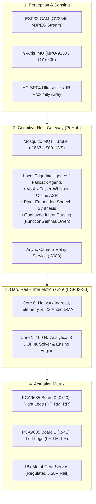

# AI Spider Hexapod V2 — Technical documentation portal and system index

[](https://astro.build)
[](https://tailwindcss.com)
[](https://opensource.org/licenses/MIT)
[](https://grrgrrman.github.io/spider-blog/)

Central documentation repository, mathematical kinematics derivations, CAD assets, and operational logs for the **18-Degree-of-Freedom (18-DoF) Biomimetic Hexapod Robotic Platform**.

* **Live Documentation Portal:** [grrgrrman.github.io/spider-blog](https://grrgrrman.github.io/spider-blog/)

---

## 1. System mission and architectural evolution

Traditional search-and-rescue and environmental survey robots face critical physical failure modes in hazardous terrains:
* **Wheeled and tracked rovers:** Suffer catastrophic high-centering, loss of ground traction, and zero vertical clearance adaptability on non-planar rubble or cave environments.
* **Aerial drones:** Incapable of physical ground interaction, highly vulnerable to turbulent enclosed airflow, and restricted by extreme battery discharge rates.

The **AI Spider** platform utilizes an 18-DoF multi-legged chassis to establish continuous triangular ground support (Tripod Gait), omnidirectional translation without a turning radius, and dynamic clearance adjustment (`hipstance` scaling and individual leg elevation `ty -> up`).



> [!NOTE]
> **Edge paradigm realignment:** While early bench prototypes evaluated cloud multimodal APIs (Groq / LLaMA 3.3), operational field requirements in disconnected zones (caves, collapsed structures) mandate on-device edge execution. Future revisions focus on lightweight local inference and IMU-stabilized dynamic gait compensation.

---

## 2. Ecosystem subsystems and repository index

| Subsystem / layer | Repository / asset URL | Tech stack | Architectural role |
| :--- | :--- | :--- | :--- |
| **Documentation portal** | [`grrgrrman.github.io/spider-blog`](https://grrgrrman.github.io/spider-blog/) | Astro 7, Tailwind 4, MDX, KaTeX, Mermaid | Complete scientific manual, mathematical derivations, BOM ledger, and build logs |
| **Motion firmware** | [`GrrGrrMan/spiderbot-firmware`](https://github.com/GrrGrrMan/spiderbot-firmware) | C++, FreeRTOS SMP, PlatformIO, ESP32-S3 | 100 Hz deterministic IK loop, dual PCA9685 phase staggering, I2S DMA audio |
| **Cognitive gateway** | [`GrrGrrMan/spiderbot-pi-hub`](https://github.com/GrrGrrMan/spiderbot-pi-hub) | Python 3.11, Faster-Whisper, Mosquitto, Nginx | Host gateway, Wi-Fi hotspot AP, Piper TTS, and local/cloud LLM proxy |
| **3D digital twin** | [`GrrGrrMan/spiderbot-mithi-web`](https://github.com/GrrGrrMan/spiderbot-mithi-web) | React 16, Plotly.js WebGL, WebSockets | Web-based kinematics simulator, Web Worker kinematics offloading, 10 Hz telemetry |
| **Live simulator** | [`spiderbot-playground.netlify.app`](https://spiderbot-playground.netlify.app/) | WebGL / Production static build | Interactive browser sandbox and 3D digital twin |
| **Parametric CAD** | [`Enclosed body 2.0 (Onshape)`](https://cad.onshape.com/documents/97670e8943e0cc50e830c42a/w/00e0069e98a6590d172338eb/e/8904dbdba274489211ded1bf?renderMode=0&uiState=6a8cd46a6dfb0f4caeea9e32) | Onshape CAD | 3D printable PETG monocoque shell, 3-DoF leg linkages, and presentation stand |

---

## 3. Documentation information architecture

The documentation portal adheres to the **Diátaxis Framework**, structuring information across four distinct modes:

```text
spider-blog/
├── src/
│   ├── components/          # Modular Astro UI components
│   │   ├── Admonition.astro
│   │   ├── MobileSubNav.astro
│   │   ├── NavBar.astro
│   │   ├── Pagination.astro
│   │   ├── ProductLinks.astro
│   │   ├── Sidebar.astro
│   │   └── TableOfContents.astro
│   ├── content/
│   │   ├── docs/            # Formal technical chapters (00-08)
│   │   └── logbook/         # Development milestones
│   ├── data/
│   │   ├── docsNav.ts       # Navigation taxonomy
│   │   ├── links.ts         # Centralized asset links
│   │   └── logbookData.ts   # Build and failure records
│   ├── layouts/
│   │   ├── BaseLayout.astro # HTML5 root shell
│   │   ├── DocsLayout.astro # 3-column documentation frame
│   │   └── MainLayout.astro # Single-column content layout
│   ├── lib/
│   │   ├── client/          # Lifecycle & observer registry
│   │   └── diagram/         # Mermaid pan-zoom engine
│   └── styles/
│       ├── docs.css         # Tailwind v4 tokens & KaTeX
│       └── diagram.css      # Viewport styles & skeletons
├── astro.config.mjs
└── package.json
```

### Chapter overview

1. **[`00 Mission rationale and scope`](https://grrgrrman.github.io/spider-blog/docs/mission-and-intentions):** Tactical mission rationale, extreme terrain locomotion advantages, cloud-to-edge roadmap.
2. **[`01 System topology and architecture`](https://grrgrrman.github.io/spider-blog/docs/system-overview):** Multi-tier distributed compute hierarchy, network interconnects, and node protocols.
3. **[`02 Bill of materials and procurement`](https://grrgrrman.github.io/spider-blog/docs/bill-of-materials):** Component manifest, fastener sizing, historical procurement ledger (~$350 NZD), and paradigm shift analysis.
4. **[`03 CAD models and additive fabrication`](https://grrgrrman.github.io/spider-blog/docs/3d-cad-fabrication):** Parametric Onshape links, 35% Gyroid infill PETG slicer configurations, and print orientation tables.
5. **[`04 Power distribution and pinouts`](https://grrgrrman.github.io/spider-blog/docs/electrical-power):** 5.30V dual-rail power topology, common ground rules, complete GPIO pinouts, and PWM phase staggering proofs.
6. **[`05 Embedded firmware and motion core`](https://grrgrrman.github.io/spider-blog/docs/embedded-firmware):** FreeRTOS SMP task partitioning, analytical 3-DoF IK equations, gait generator math, and safety watchdogs.
7. **[`06 Host gateway and voice AI engine`](https://grrgrrman.github.io/spider-blog/docs/pi-ai-hub):** Raspberry Pi host setup, MQTT taxonomy, binary PCM audio protocol, and multimodal agent contracts.
8. **[`07 3D digital twin and web simulation`](https://grrgrrman.github.io/spider-blog/docs/web-3d-dashboard):** React + Plotly WebGL kinematics digital twin, Web Worker trajectory offloading, and Silero VAD audio pipeline.
9. **[`08 Empirical results and torque limits`](https://grrgrrman.github.io/spider-blog/docs/empirical-results):** 1,310g dry weight audit, actuator torque physics formulation ($4.15\text{ kg}\cdot\text{cm}$ demand), and custom DTC testing stand resolution.

---

## 4. Mechanical and electrical specifications

### Weight and kinematic torque budget

$$\tau_{\text{required}} = F_{\text{leg}} \cdot L_{\text{arm}} = \left(\frac{1.310\text{ kg} \times 9.81\text{ m/s}^2}{3}\right) \times 0.095\text{ m} \approx 0.407\text{ N}\cdot\text{m} \approx 4.15\text{ kg}\cdot\text{cm}$$

| Subsystem component | Mass (g) |
| :--- | :---: |
| 6x Leg assemblies (PETG brackets) | 240 g |
| 18x MG90S Micro servos | 234 g |
| Monocoque main body housing & lid | 210 g |
| Power wiring, harnesses & bus bars | 125 g |
| Dual buck converters & fuse blocks | 68 g |
| Raspberry Pi 4B host computer | 65 g |
| Audio subsystem (Amp + Speaker) | 46 g |
| Dual ESP32 microcontrollers | 42 g |
| Fasteners, standoffs, connectors | 80 g |
| **Net chassis mass (excluding battery)** | **1,110 g** |
| 3S 1800mAh Flight LiPo pack | 200 g |
| **All-up operational mass** | **1,310 g** |

> [!WARNING]
> **Actuator operating ceiling:** Budget micro-gear servos (MG90S) offer a peak stall torque of $1.8\text{–}2.2\text{ kg}\cdot\text{cm}$ and continuous thermal capacity under $0.8\text{ kg}\cdot\text{cm}$. The $4.15\text{ kg}\cdot\text{cm}$ static stance demand exceeds continuous ratings. The platform is demonstrated on a custom PETG testing stand connected to a regulated 5.30V DC bench supply to validate all kinematic, vision, and audio loops safely.

---

## 5. Local development and deployment

### Prerequisites
* **Node.js:** `v20.x` or `v24.x` (LTS recommended)
* **Package manager:** `npm` (v10+)

### Setup commands

```bash
# 1. Clone repository
git clone https://github.com/GrrGrrMan/spider-blog.git
cd spider-blog

# 2. Install dependencies
npm install

# 3. Start local development server
npm run dev

# 4. Compile production static bundle
npm run build

# 5. Preview production build locally
npm run preview
```

The portal will be hosted locally at `http://localhost:4321`.

---

## 6. Academic references and attributions

* **Mithi Hexapod Kinematics Model:** [github.com/mithi/hexapod](https://github.com/mithi/hexapod) — Foundational trigonometric kinematics formulations.
* **OmniRoute Gateway Architecture:** [github.com/diegosouzapw/OmniRoute](https://github.com/diegosouzapw/OmniRoute) — High-throughput OpenAI-compatible proxy design.
* **Espressif Systems ESP-IDF:** [docs.espressif.com](https://docs.espressif.com/projects/esp-idf/en/stable/esp32/get-started/index.html) — FreeRTOS dual-core SMP task allocation patterns.
* **PlatformIO Embedded Ecosystem:** [platformio.org](https://platformio.org/) — Unified cross-platform build and flashing toolchain.

---

## 7. License

Distributed under the **MIT License**. See [LICENSE](LICENSE) for full details. Open-source hardware designs are provided under CERN-OHL-P v2.