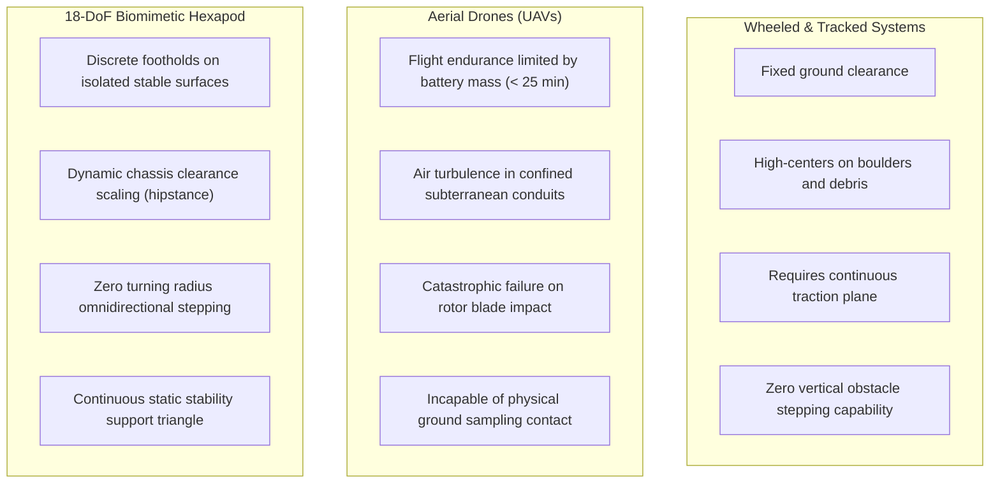
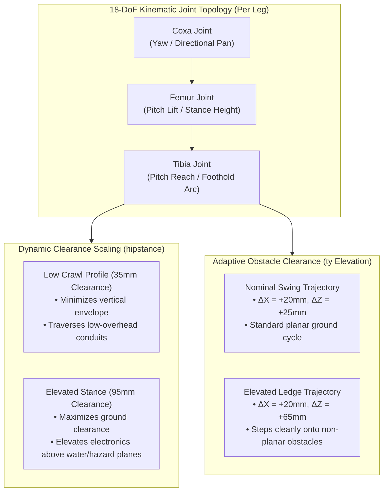
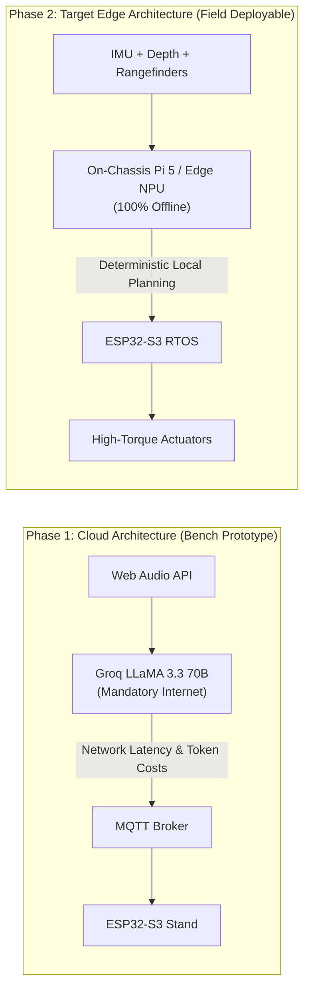
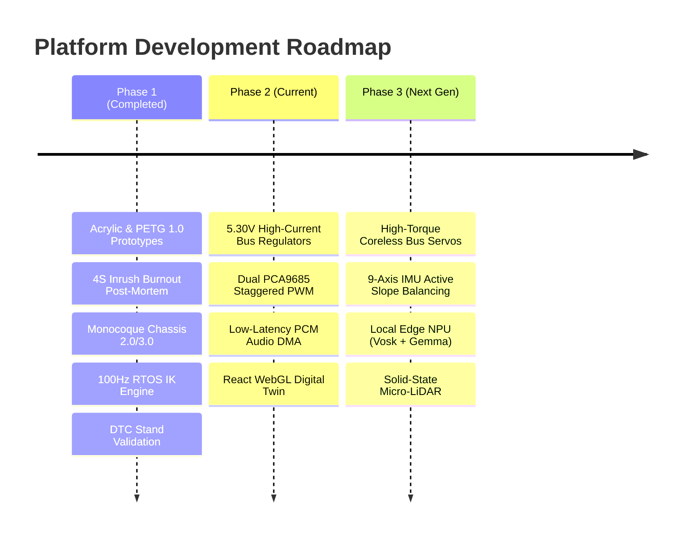

## 1. Problem statement: Hazardous and extreme environments

Industrial accident zones, collapsed structures, subterranean cave systems, dense wilderness, and extraterrestrial topographies present hazardous operating conditions where human entry carries extreme risk.

Traditional robotic exploration platforms face critical mechanical limitations in these terrains:

The core objective of this project is to develop an **accessible, 18-Degree-of-Freedom (18-DoF) biomimetic hexapod platform** capable of traversing non-planar, discontinuous, and hazardous terrain where conventional wheeled and aerial vehicles fail.

---

## 2. Kinematic advantages of 18-DoF locomotion

Unlike wheeled vehicles that require continuous rolling contact, a hexapod interacts with terrain through **discrete ground contact points**. By employing three revolute joints per leg—Coxa (Yaw), Femur (Pitch Lift), and Tibia (Pitch Reach)—the chassis gains 6-DoF spatial adaptability:

### Dynamic terrain traversal capabilities

1. **Dynamic clearance scaling (`hipstance -> up / down`):** Modulates vertical ground clearance dynamically to crawl beneath low overhead conduits or elevate sensitive electronics bays above standing water, mud, and thermal hazards.
2. **Per-leg obstacle elevation (`ty -> up`):** Recalculates swing trajectories in real time when proximity sensors detect obstructions, elevating the tibia to step onto or over obstacles without stalling the femur joint.
3. **Omnidirectional stepping:** Combines translational velocity vectors $(V_x, V_y)$ with yaw rate $\omega$ to immediately change heading without requiring a turning radius.
4. **Triangular static stability:** Enforces a Tripod Gait where three feet maintain ground contact at all times, keeping the Center of Gravity (CoG) enclosed within the support polygon.

---

## 3. Architecture evolution: Cloud multimodal vs. local edge autonomy

### Phase 1: Cloud multimodal architecture (bench prototype)

Initial prototypes evaluated natural language task decomposition using browser speech recognition, WebSockets, and cloud-hosted LLMs (Groq LLaMA 3.3 70B via Function Calling).

> [!WARNING]
> **Cloud dependency limitations:** In real-world disaster sites, deep caves, and remote environments, WAN connectivity is unavailable. Cloud inference introduces non-deterministic network latency, link drop vulnerability, and recurring token costs.

### Phase 2: Local edge autonomy (target architecture)

The platform is migrating toward a **100% localized, on-chassis compute stack**:

* **Quantized intent parsing:** On-device compact models (FunctionGemma 270M or Qwen 0.6B) running locally via `llama.cpp` or ONNX Runtime.
* **Offline speech processing:** Embedded `Vosk` automatic speech recognition and `Piper TTS` speech synthesis operating without network uplinks.
* **Autonomous local mapping:** Real-time 2D/2.5D hazard mapping calculated on the companion single-board computer.

---

## 4. Hardware validation and DTC testing stand resolution

Physical evaluation of the Prototype 3.0 monocoque design established critical mass and torque boundaries:

$$\tau_{\text{required}} = \left(\frac{1.310\text{ kg} \times 9.81\text{ m/s}^2}{3}\right) \times 0.095\text{ m} \approx 0.407\text{ N}\cdot\text{m} \approx 4.15\text{ kg}\cdot\text{cm}$$

* **Actuator operating envelope:** Budget MG90S metal-gear micro-servos provide a stall torque of $1.8\text{–}2.2\text{ kg}\cdot\text{cm}$ and continuous thermal capacity under $0.8\text{ kg}\cdot\text{cm}$. The $4.15\text{ kg}\cdot\text{cm}$ demand exceeds the continuous thermal rating by a factor of 5.
* **Testing stand resolution:** The platform is operated on a custom PETG **DTC Testing Stand** supplied by an external regulated 5.30V DC bench rail. This eliminates the 280g battery burden, allowing full empirical verification of the 18-DoF analytical Inverse Kinematics, 100 Hz FreeRTOS dual-core task partitioning, video relays, and AI pipeline without gear stripping or thermal brownouts.

---

## 5. Engineering expansion roadmap

### 1. Actuation and structural upgrades
* Replace analog micro-servos with high-voltage (7.4V) serial bus servos equipped with magnetic position feedback and continuous stall protection.
* Transition structural linkages from solid PETG to skeletonized carbon-fiber reinforced nylon to cut limb inertia by 40%.

### 2. Inertial dynamic balance leveling
* Mount the MPU-9250 / GY-6500 9-Axis IMU on EVA anti-vibration dampening foam directly at the Center of Mass (CoM).
* Feed pitch/roll attitude deltas directly into the 100 Hz Inverse Kinematics loop to automatically keep the chassis level when traversing uneven slopes.

### 3. Spatial perception and elevation mapping
* Upgrade from single-point HC-SR04 ultrasonic sensors to solid-state micro-LiDAR or a spatial stereo depth camera.
* Construct 2.5D elevation grid maps in real time, feeding step height parameters directly to the gait generator to step over obstacles autonomously.