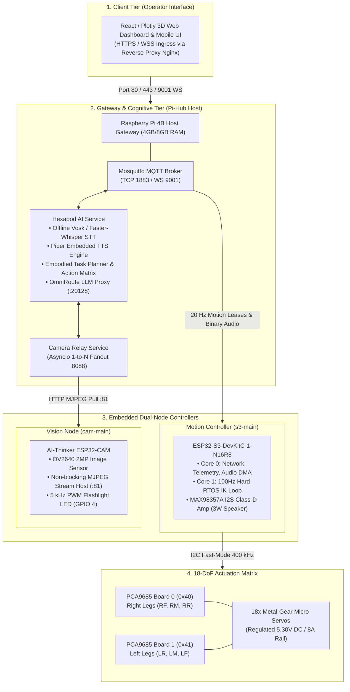
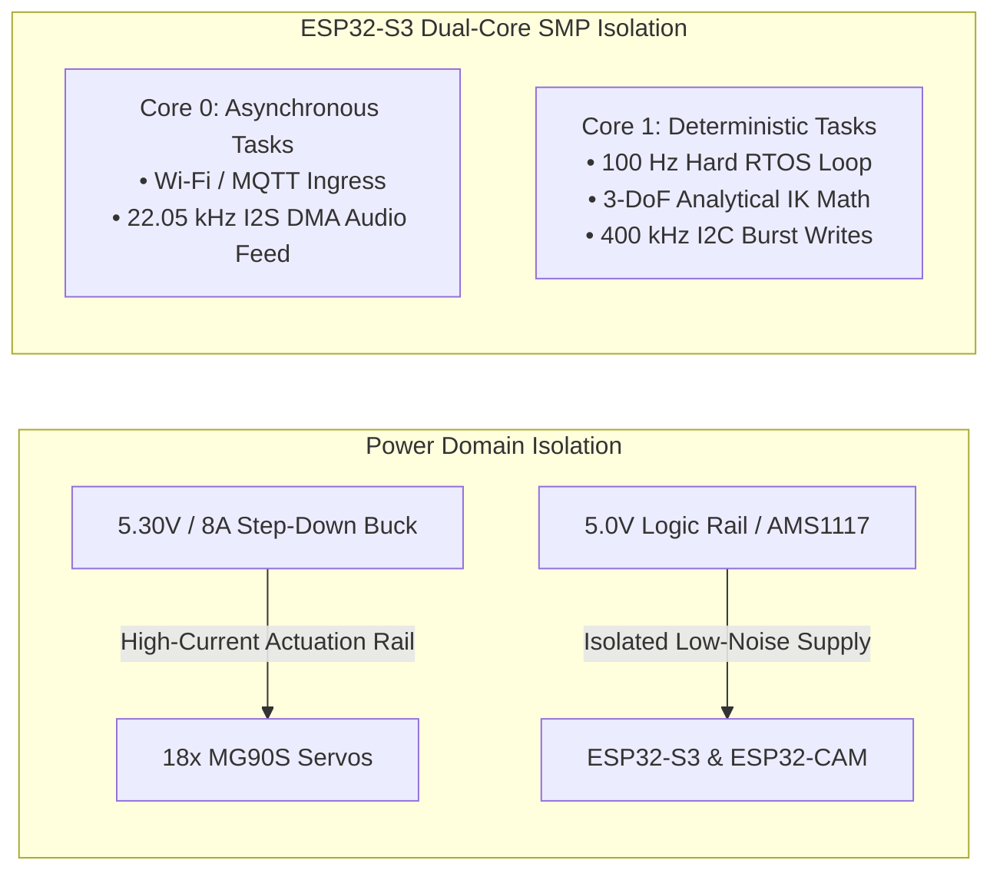
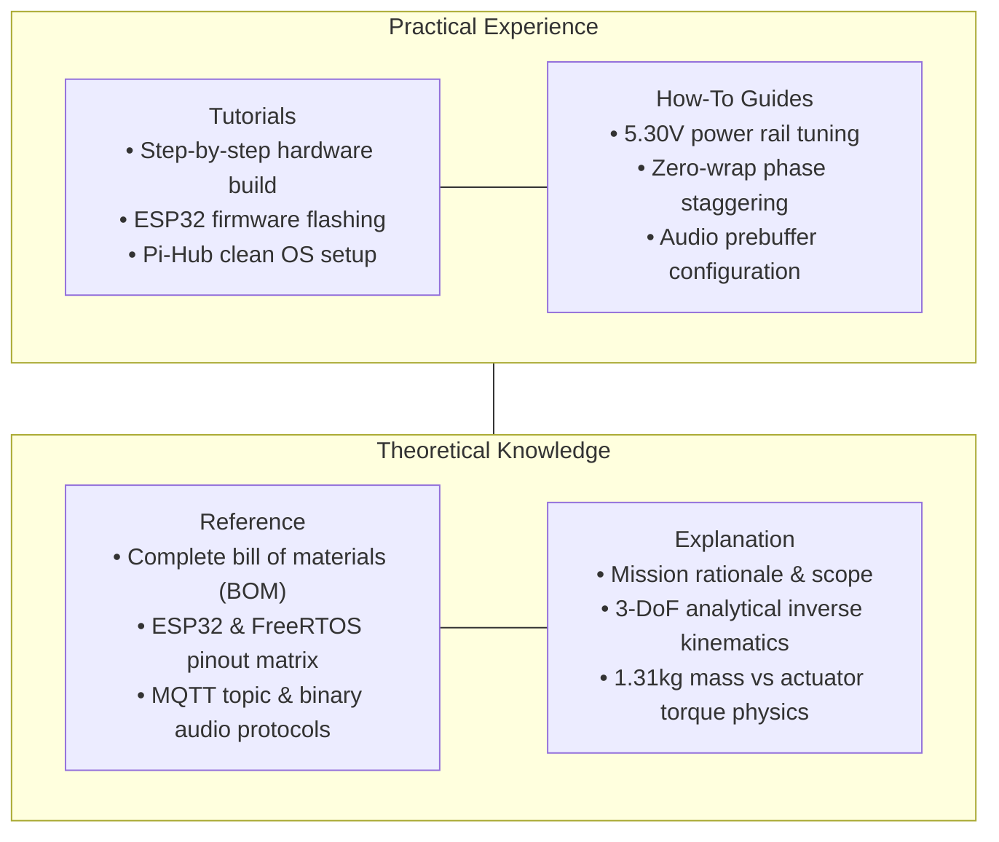

The **Hexapod V2** platform decouples high-frequency deterministic motion control, digital audio conversion, real-time video streaming, and cognitive intelligence across four distinct compute tiers.

## 1. Multi-tier distributed compute hierarchy

---

## 2. Inter-tier communication matrix

| Source node | Target node | Physical / network layer | Payload type & frequency |
| :--- | :--- | :--- | :--- |
| **Client web UI** | **Pi-Hub (Nginx)** | TCP 80 / 443 (WSS) | React SPA assets & WebSockets |
| **Client web UI** | **Pi-Hub (Mosquitto)** | WebSocket Port 9001 | Ingress teleoperation & AI chat directives |
| **Client web UI** | **Pi-Hub (Cam relay)** | HTTP Port 8088 | Multipart MJPEG broadcast stream |
| **Pi-Hub (ai-service)** | **ESP32-S3 (s3-main)** | MQTT TCP Port 1883 | 22.05 kHz 10-byte framed raw PCM stream |
| **Pi-Hub (ai-service)** | **ESP32-S3 (s3-main)** | MQTT TCP Port 1883 | 20 Hz command leases (`hexapod/{id}/cmd`) |
| **ESP32-S3 (s3-main)** | **Pi-Hub (Mosquitto)** | MQTT TCP Port 1883 | 10 Hz telemetry & operational state |
| **ESP32-CAM (cam-main)** | **Pi-Hub (Cam relay)** | HTTP Port 81 (`/stream`) | 10–15 FPS raw MJPEG ingest |
| **ESP32-CAM (cam-main)** | **Pi-Hub (Mosquitto)** | MQTT TCP Port 1883 | 1 Hz discovery & camera heartbeat |
| **ESP32-S3 (s3-main)** | **Dual PCA9685** | I2C (GPIO 41 / GPIO 42) | 400 kHz 12-bit staggered PWM pulse writes |
| **ESP32-S3 (s3-main)** | **MAX98357A DAC** | I2S (GPIO 38 / 39 / 40) | 705.6 kHz BCLK DMA mono audio stream |

---

## 3. Real-time hardware and logic isolation guarantees

1. **Deterministic control loop:** High-frequency inverse kinematics calculations and I2C servo commits run on FreeRTOS Core 1 on a strict $10.0\text{ ms}$ interval (`vTaskDelayUntil`). Wi-Fi interrupts and TCP streaming on Core 0 cannot preempt or delay physical stepping.
2. **Current surge decoupling:** Actuation power is separated from microcontroller logic using dedicated 300W buck regulation and 1000µF reservoir capacitors, preventing inrush brownouts during synchronized gait transitions.

---

## 4. Diátaxis documentation taxonomy

The technical documentation is organized using the **Diátaxis Framework**, structuring technical assets across four core learning and operational modes:

1. **Tutorials (learning-oriented):** Step-by-step assembly guides, PlatformIO flashing workflows, and gateway deployment scripts.
2. **How-to guides (problem-oriented):** Tuning 5.30V buck regulators, eliminating current ripple via phase staggering, and configuring low-latency audio prebuffering.
3. **Reference (information-oriented):** Exact hardware pinout matrices, Bill of Materials with MPNs, MQTT JSON/Binary contracts, and register addresses.
4. **Explanation (understanding-oriented):** Tactical mission scope, analytical Inverse Kinematics derivations, 6-DoF Euler pose transformations, and mass-versus-torque mechanical physics.