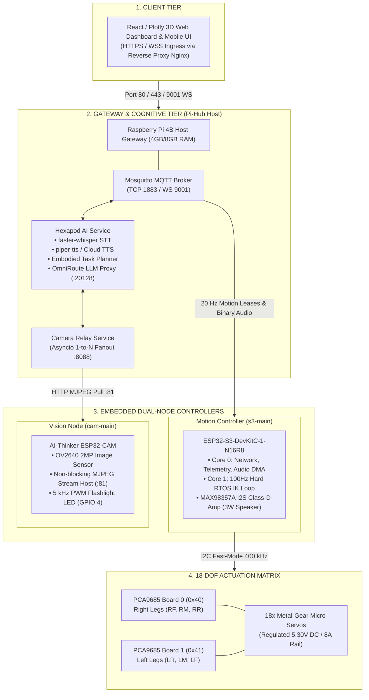
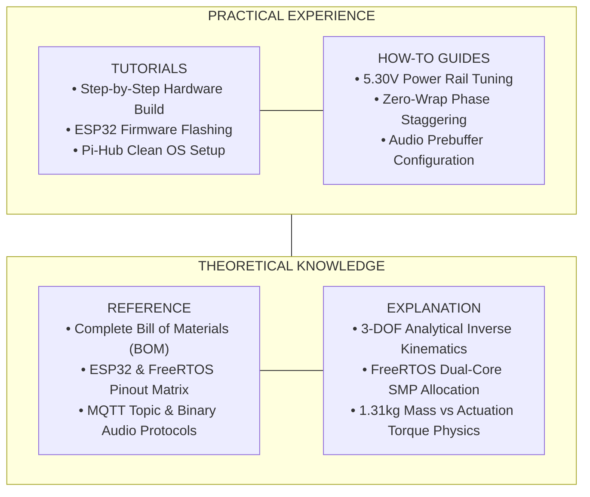

The **Hexapod V2** platform decouples high-frequency deterministic motion control, digital audio digital-to-analog conversion, real-time video streaming, and cognitive multimodal artificial intelligence across three distinct compute tiers.

## Multi-Tier Distributed Architecture

## Inter-Tier Communication Matrix

| Source Node | Target Node | Physical / Network Layer | Payload Type & Frequency |
| :--- | :--- | :--- | :--- |
| **Client Web UI** | **Pi-Hub (Nginx)** | TCP 80 / 443 (WSS) | React SPA Assets & WebSockets |
| **Client Web UI** | **Pi-Hub (Mosquitto)** | WebSocket Port 9001 | Ingress Teleoperation & AI Chat Directives |
| **Client Web UI** | **Pi-Hub (Cam Relay)** | HTTP Port 8088 | Multipart MJPEG Broadcast Stream |
| **Pi-Hub (ai-service)** | **ESP32-S3 (s3-main)** | MQTT TCP Port 1883 | 22.05 kHz 10-byte Framed Raw PCM Stream |
| **Pi-Hub (ai-service)** | **ESP32-S3 (s3-main)** | MQTT TCP Port 1883 | 20 Hz Command Leases (`hexapod/{id}/cmd`) |
| **ESP32-S3 (s3-main)** | **Pi-Hub (Mosquitto)** | MQTT TCP Port 1883 | 10 Hz Telemetry & Operational State |
| **ESP32-CAM (cam-main)** | **Pi-Hub (Cam Relay)** | HTTP Port 81 (`/stream`) | 10–15 FPS Raw MJPEG Ingest |
| **ESP32-CAM (cam-main)** | **Pi-Hub (Mosquitto)** | MQTT TCP Port 1883 | 1 Hz Discovery & Camera Heartbeat |
| **ESP32-S3 (s3-main)** | **Dual PCA9685** | I2C (GPIO 41 / GPIO 42) | 400 kHz 12-Bit Staggered PWM Pulse Writes |
| **ESP32-S3 (s3-main)** | **MAX98357A Amp** | I2S (GPIO 38 / 39 / 40) | 705.6 kHz BCLK DMA Mono Audio Stream |

## Diátaxis System Framework

1. **Tutorials (Learning-Oriented):** Step-by-step assembly, flashing workflows, and gateway deployment guides.
2. **How-To Guides (Problem-Oriented):** Tuning 5.30V buck regulators, eliminating current ripple via phase staggering, and configuring low-latency audio prebuffering.
3. **Reference (Information-Oriented):** Exact hardware pinout matrices, Bill of Materials with MPNs, MQTT JSON/Binary contracts, and register addresses.
4. **Explanation (Understanding-Oriented):** Analytical Inverse Kinematics derivation, 6-DOF Euler pose transformations, and mass-versus-torque mechanical physics.