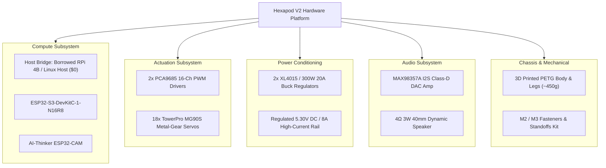
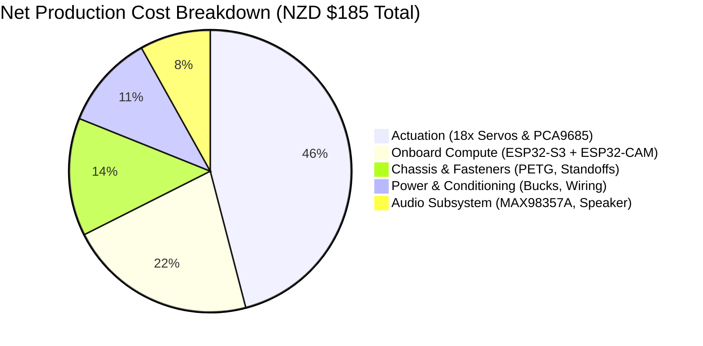
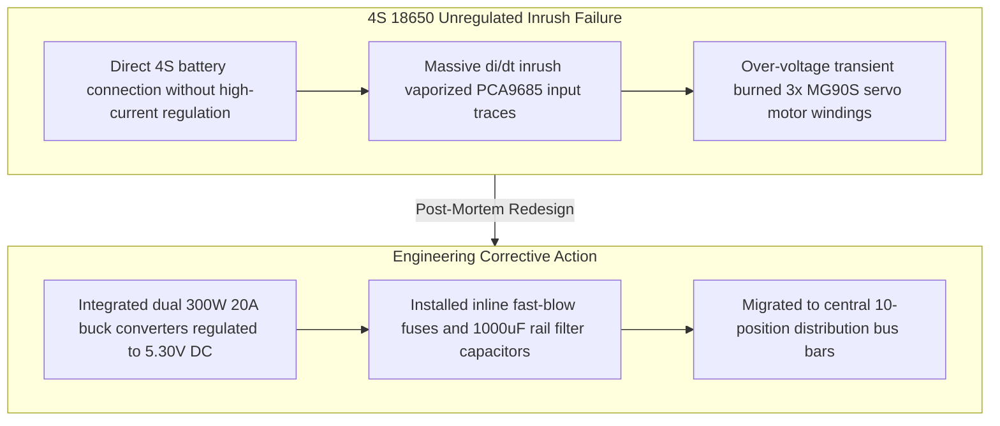

All physical, electrical, and computational components required to construct, reproduce, and evaluate the 18-DoF Hexapod V2 platform.

## 1. Subsystem hardware hierarchy

---

## 2. Production hardware manifest

| Category | Component description | Manufacturer part / model | Qty | Key specifications | Primary functional role |
| :--- | :--- | :--- | :---: | :--- | :--- |
| **Compute (host)** | Single board computer / host | Raspberry Pi 4B (or Linux host) | 1 | Broadcom BCM2711 / 4GB-8GB RAM, Gigabit Ethernet | Cognitive AI gateway, Mosquitto broker, voice STT/TTS pipeline (*Borrowed / Pre-owned*) |
| **Compute (robot)** | Main motion controller | ESP32-S3-DevKitC-1-N16R8 | 1 | Dual-Core Xtensa LX7 @ 240MHz, 16MB Flash, 8MB PSRAM | 100 Hz RTOS deterministic IK loop, 18-servo driver control, I2S audio stream DMA |
| **Compute (robot)** | Vision and illumination node | AI-Thinker ESP32-CAM | 1 | ESP32-D0WDQ6 @ 240MHz, 4MB Flash, 2MB PSRAM, OV2640 | Independent HTTP MJPEG stream server (:81), 5 kHz PWM flashlight LED driver |
| **Actuation** | Metal-gear micro servos | TowerPro MG90S | 18 | Operating voltage: 4.8V–6.0V, Stall torque: 1.8–2.2 kg·cm, Weight: 13.4g | 3-DoF revolute joints per leg: Coxa (Yaw), Femur (Pitch Lift), Tibia (Pitch Reach) |
| **Actuation** | 16-channel PWM drivers | PCA9685 I2C module | 2 | 12-Bit resolution (4096 steps), I2C Fast-Mode (400 kHz), Hardware OE pin | Drives 18 independent servo channels via staggered rising edges (0x40, 0x41) |
| **Power** | High-current step-down buck | 300W 20A / XL4015 regulator | 2 | Input: 7V–32V DC, Output: 5.30V DC tuned, 5A continuous / 8A surge | Dedicated, regulated high-current power rail for 18 servos and logic isolation |
| **Audio** | I2S Class-D DAC amplifier | Adafruit MAX98357A | 1 | 3.2W into 4Ω, 3.3V logic, sample rates 8 kHz to 96 kHz | Hardware digital-to-analog audio decoding from ESP32-S3 I2S stream |
| **Audio** | Dynamic micro speaker | Generic 4Ω 3W 40mm | 1 | 4 Ohm impedance, 3 Watt nominal power, 40mm diameter | Acoustic speech feedback for real-time natural language AI interaction |
| **Chassis** | Additive manufacturing | PETG filament (1.75mm) | ~450g | Tensile strength: 50 MPa, Impact resistance, Heat deflection: 75°C | 3D printed monocoque chassis base, upper electronics lid, 6 leg linkages, head mount |
| **Hardware** | Fasteners and standoffs | Stainless and brass kit | 1 Kit | M2x6mm, M2x8mm self-tapping screws; M3x6mm, M3x10mm brass standoffs | Servo horn linkages, PCA9685 mounting, chassis closure, PCB standoffs |

---

## 3. Fastener and standoff sizing matrix

| Fastener type | Dimensions | Quantity | Target location |
| :--- | :--- | :---: | :--- |
| **Self-tapping pan head** | M2 x 6 mm | 36 | Fastening nylon/metal servo horns into 3D printed Coxa, Femur, and Tibia pockets |
| **Self-tapping pan head** | M2 x 8 mm | 18 | Securing micro servo output spline central pivot screws |
| **Hex standoffs (male-female)**| M3 x 10 mm + 6 mm thread | 4 | Elevating PCB stack above lower wire routing channels |
| **Hex standoffs (female-female)**| M3 x 6 mm | 8 | Dual PCA9685 board mounting bosses in lower chassis |
| **Machine screws (button head)**| M3 x 6 mm | 16 | Securing PCB boards, buck converters, and chassis top plate |

---

## 4. Production cost breakdown

| Component group | Sourcing channels | Net cost (NZD) |
| :--- | :--- | :---: |
| **Onboard microcontrollers** | Element14 NZ / DigiKey / PB Tech (ESP32-S3 DevKit + ESP32-CAM) | $40.00 |
| **Actuators and drivers** | Amazon NZ / AliExpress (18x MG90S metal-gear servos + 2x PCA9685) | $85.00 |
| **Power conditioning** | Surplustronics / Direct Electronics (2x 300W/XL4015 5A buck regulators) | $20.00 |
| **Audio subsystem** | Adafruit Reseller (MAX98357A I2S DAC amp + 40mm 3W speaker) | $15.00 |
| **Chassis and hardware** | Marvle3D (~450g PETG filament consumed + M2/M3 fastener kit) | $25.00 |
| **Host gateway (Pi-Hub)** | *Borrowed Raspberry Pi 4B / Existing Linux Computer* | **$0.00** |
| **Net fabrication cost** | | **~$185.00 NZD** |

---

## 5. Development and experimental procurement ledger

> [!NOTE]
> This ledger documents all raw materials, evaluation sensors, and power infrastructure procured across development iterations. It reflects cumulative prototyping expenses rather than the net BOM of a single finished unit.

| Component / raw material description | Functional category | Iteration phase | Qty | Approx. cost (NZD) |
| :--- | :--- | :--- | :---: | :---: |
| **MG90S 180° metal-gear micro servos** | Actuation subsystem | Prototyping & Final | 18 | $82.00 |
| **PCA9685 16-channel 12-bit PWM drivers** | Actuator drivers | Iterations 1–3 | 2 | $11.11 |
| **ESP32-CAM OV2640 + motherboard base** | Vision & initial MCU | Bench Testing | 1 | $20.00 |
| **ESP32-S3 IPEX development board** | Motion controller | Current Core | 1 | $15.00 |
| **FT232RL FTDI USB-to-TTL serial converters** | Programming / telemetry | Debug Infrastructure | 4 | $8.50 |
| **3S 11.1V 1800mAh high-discharge LiPo** | Mobile power source | Current Stand Tether | 1 | $28.32 |
| **18650 flat-top Li-Ion cells (2S/4S packs)** | Mobile power source | Deprecated Prototype | 2 | $25.77 |
| **Modular 2S & 4S battery holders** | Power enclosure | Prototype 2.0 | 3 | $11.35 |
| **300W 20A step-down buck converters** | Voltage regulation | Current Core | 2 | $18.50 |
| **LM2596 adjustable DC-DC buck regulators** | Logic regulation | Iteration 2 | 2 | $5.22 |
| **10-position ground / power distribution bus bars** | Power rail harness | Current Core | 3 | $12.00 |
| **XT60 modular connectors, splitters & 14 AWG leads** | Power harnessing | Current Core | 1 Set | $14.50 |
| **Inline fast-blow fuse holders and fuses** | Electrical safety | Current Core | 2 | $4.50 |
| **LiPo low-voltage buzzer / alarm module** | Telemetry safety | Field Integration | 1 | $3.50 |
| **TP4056 single-cell lithium charging modules** | Bench support | Lab Consumable | 2 | $8.02 |
| **HC-SR04 ultrasonic distance sensor** | Spatial ranging | Perception Suite | 1 | $3.74 |
| **IR infrared obstacle avoidance proximity sensors** | Proximity detection | Foot/Chassis Ranging | 2 | $4.29 |
| **MPU-9250 / GY-6500 9-axis IMU module** | Attitude & dynamic pose | Balance Feedback | 1 | $5.57 |
| **Transparent acrylic stock sheets (200x200x3mm)** | Chassis fabrication | Chassis 1.0 (Discarded)| 2 | $20.00 |
| **PETG 3D printing filament spools (1.75mm)** | Additive manufacturing | Chassis 2.0 / 3.0 | 2 Spools | $50.00 |
| **M2/M3 stainless hardware, screws & standoffs**| Fasteners | Chassis 1.0–3.0 | 450 pcs | $4.85 |
| **B7000 adhesive & electrical insulation tape**| Assembly consumables | Lab Supplies | 2 | $7.31 |
| **SPDT high-current power toggle switches** | Control interface | Power Isolation | 2 | $4.00 |
| **Electrolytic filter capacitors (100uF & 1000uF)** | Rail stabilization | Inrush Protection | 20 | $5.77 |
| **Dupont interconnect ribbon cable assemblies** | Signal wiring | Interconnects | 1 Set | $7.12 |
| **Total cumulative procurement** | | | | **~$350.00 NZD** |

---

## 6. Hardware failure analysis and iteration post-mortem

* **Root cause 1 (electrical inrush):** Connecting 4S 18650 battery packs directly through low-current LM2596 modules caused transient voltage spikes exceeding driver limits, destroying one PCA9685 board and burning three MG90S servos.
* **Mitigation 1:** Installed dual 300W 20A high-current buck converters regulated to 5.30V DC, added 1000µF decoupling capacitors across the servo rails, and integrated inline fast-acting fuses.
* **Root cause 2 (mechanical delamination):** Chassis 1.0 relied on laser-cut acrylic joined with adhesive. Dynamic limb vibrations sheared joint interfaces under load.
* **Mitigation 2:** Migrated to monolithic PETG 3D-printed brackets with captive M2/M3 fastener pockets.

---

## 7. Strategic architecture realignment and edge roadmap

> [!WARNING]
> **Engineering scope realignment:** While early iterations evaluated remote multimodal cloud APIs (e.g., Groq / LLaMA 3.3 over Wi-Fi), this approach is fundamentally unviable for real-world field operations due to non-deterministic latency, mandatory internet connectivity, and token cost overhead.

### Primary objective: Extreme and hazardous terrain navigation

The platform's primary mission is navigation in hazardous, unstructured, and non-planar environments (cave networks, disaster rubble, dense vegetation, and extraterrestrial-analog surfaces) where conventional wheeled rovers get high-centered and aerial drones fail due to confined air currents or rotor vulnerability.

The high Degrees of Freedom (18-DoF) allow the hexapod to execute complex geometric compensation:
* **Active clearance scaling (`hipstance -> up / down`):** Adjusts overall chassis height to traverse low conduits or elevate over standing water and thermal hazards.
* **Non-planar foothold adjustment (`ty -> up`):** Dynamically calculates individual leg elevation trajectories via Inverse Kinematics (IK) to step cleanly onto rocks and ledges without chassis destabilization.

### Sensor expansion and edge compute roadmap

Future iterations transition all cognitive and kinematic processing on-chassis:
1. **Local embedded AI:** Replacing cloud APIs with on-device quantized models (e.g., FunctionGemma 270M or Qwen 0.6B for task decomposition; Vosk for offline ASR; Piper for local speech synthesis).
2. **Inertial dynamic balancing:** Integrating the MPU-9250 / GY-6500 9-axis IMU on EVA anti-vibration dampening foam directly at the Center of Mass (CoM) to dynamically level the chassis on shifting gradients.
3. **Spatial perception upgrade:** Transitioning from single-beam HC-SR04 ultrasonics to solid-state micro-LiDAR or stereo depth sensors for 2.5D elevation grid mapping and real-time obstacle boundary generation.