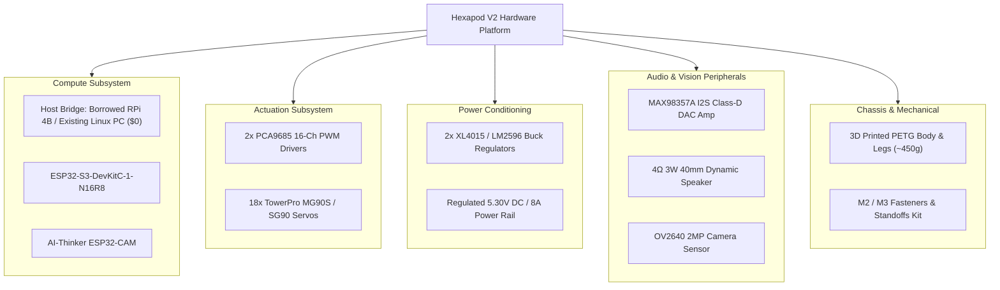
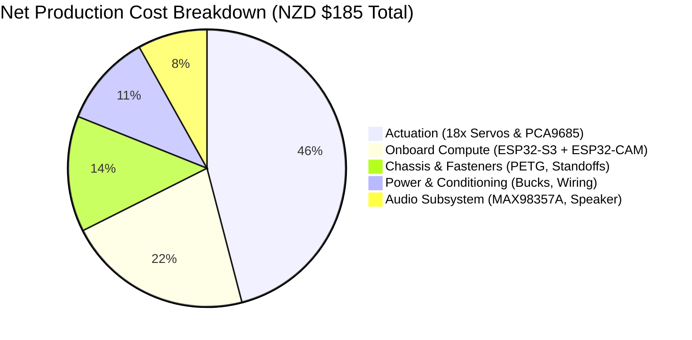

All physical, electrical, and computational components required to construct and reproduce the 18-DOF Hexapod V2 platform.

## Subsystem Hardware Hierarchy

## Complete Hardware Manifest

| Category | Component Description | Manufacturer Part / Model | Qty | Key Specifications | Primary Functional Role |
| :--- | :--- | :--- | :---: | :--- | :--- |
| **Compute (Host)** | Single Board Computer / Host | Raspberry Pi 4B (or Linux PC) | 1 | Broadcom BCM2711 / Standard x86_64 or ARM Linux host | Cognitive AI gateway, Mosquitto broker, Voice STT/TTS pipeline (*Borrowed / Pre-owned*) |
| **Compute (Robot)** | Main Motion Controller | ESP32-S3-DevKitC-1-N16R8 | 1 | Dual-Core Xtensa LX7 @ 240MHz, 16MB Flash, 8MB Octal PSRAM | 100 Hz RTOS deterministic IK loop, 18-servo driver control, I2S audio stream DMA |
| **Compute (Robot)** | Vision & Illumination Node | AI-Thinker ESP32-CAM | 1 | ESP32-D0WDQ6 @ 240MHz, 4MB Flash, 2MB PSRAM, OV2640 DVP sensor | Independent HTTP MJPEG stream server (:81), 5 kHz PWM flashlight LED driver |
| **Actuation** | Metal-Gear Micro Servos | TowerPro MG90S (or SG90) | 18 | Operating voltage: 4.8V–6.0V, Stall torque: 1.8–2.2 kg·cm, Weight: 13.4g | 3-DOF revolute joints per leg: Coxa (Yaw), Femur (Pitch Lift), Tibia (Pitch Reach) |
| **Actuation** | 16-Channel PWM Drivers | PCA9685 I2C Module | 2 | 12-Bit resolution (4096 steps), I2C Fast-Mode (400 kHz), Hardware OE pin | Drives 18 independent servo channels via staggered rising edges (0x40, 0x41) |
| **Power** | DC-DC Step-Down Buck | XL4015 (or LM2596S) | 2 | Input: 7V–32V DC, Output: 5.30V DC tuned, 5A continuous / 8A surge | Dedicated, regulated high-current power rail for 18 servos and logic isolation |
| **Audio** | I2S Class-D DAC Amplifier | Adafruit MAX98357A | 1 | 3.2W into 4Ω, 3.3V logic, sample rates 8 kHz to 96 kHz | Hardware digital-to-analog audio decoding from ESP32-S3 I2S stream |
| **Audio** | Dynamic Micro Speaker | Generic 4Ω 3W 40mm | 1 | 4 Ohm impedance, 3 Watt nominal power, 40mm diameter | Acoustic speech feedback for real-time natural language AI interaction |
| **Chassis** | Additive Manufacturing | PETG Filament (1.75mm) | ~450g | Tensile strength: 50 MPa, Impact resistance, Heat deflection: 75°C | 3D printed monocoque chassis base, upper electronics lid, 6 leg linkages, head mount |
| **Hardware** | Fasteners & Standoffs | Stainless & Brass Kit | 1 Kit | M2x6mm, M2x8mm self-tapping screws; M3x6mm, M3x10mm brass standoffs | Servo horn linkages, PCA9685 mounting, chassis closure, PCB standoffs |

## Fastener & Hardware Assembly Sizing

| Fastener Type | Dimensions | Quantity | Target Location |
| :--- | :--- | :---: | :--- |
| **Self-Tapping Pan Head** | M2 x 6 mm | 36 | Fastening nylon/metal servo horns into 3D printed Coxa, Femur, and Tibia pockets |
| **Self-Tapping Pan Head** | M2 x 8 mm | 18 | Securing micro servo output spline central pivot screws |
| **Hex Standoffs (Male-Female)**| M3 x 10 mm + 6 mm thread | 4 | Elevating PCB stack above lower wire routing channels |
| **Hex Standoffs (Female-Female)**| M3 x 6 mm | 8 | Dual PCA9685 board mounting bosses in lower chassis |
| **Machine Screws (Button Head)**| M3 x 6 mm | 16 | Securing PCB boards, buck converters, and chassis top plate |

## Reproduction Cost vs. Development Budget (NZD)

### 1. Net Reproduction Cost (Clean Build, No Waste)
If reproducing the physical robot from scratch using an existing computer/borrowed Pi:

| Component Group | Sourcing Channels | Net Cost (NZD) |
| :--- | :--- | :---: |
| **Onboard Microcontrollers** | Element14 NZ / DigiKey / PB Tech (ESP32-S3 DevKit + ESP32-CAM) | $40.00 |
| **Actuators & Drivers** | Amazon NZ / AliExpress (18x MG90S metal-gear servos + 2x PCA9685) | $85.00 |
| **Power Conditioning** | Surplustronics / Direct Electronics (2x XL4015 5A buck regulators) | $20.00 |
| **Audio Subsystem** | Adafruit Reseller (MAX98357A I2S DAC amp + 40mm 3W speaker) | $15.00 |
| **Chassis & Hardware** | Marvle3D (~450g PETG filament consumed + M2/M3 fastener kit) | $25.00 |
| **Host Brain (Pi-Hub)** | *Borrowed Raspberry Pi 4B / Existing Linux Computer* | **$0.00** |
| **NET BOT FABRICATION COST** | | **~$185.00 NZD** |

### 2. Total Project Development Spend (Including Prototyping & Spares)
The total amount spent across of raw material all experimental iterations was **~$350.00 NZD**, which accounted for:
* **Initial Prototyping:** hand-cut acrylic sheets, hot glue, and early mechanical mockups later discarded.
* **Component Failures:** 3x burned micro servos and a PCA9685 board damaged during the 4x 18650 inrush failure before implementing fuses and buck regulators.
* **Material Iterations:** Multiple test spools of PETG for Chassis 1.0 (flat plate) before converging on the final Chassis 2.0 monocoque design.