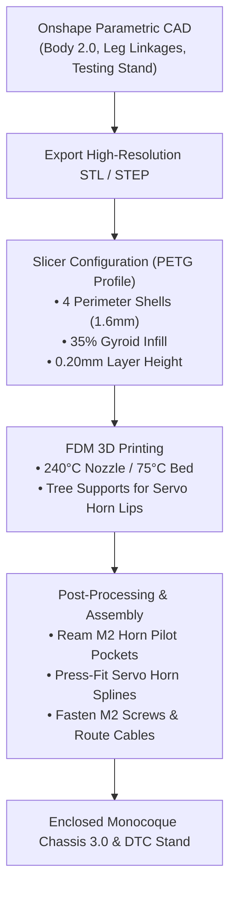
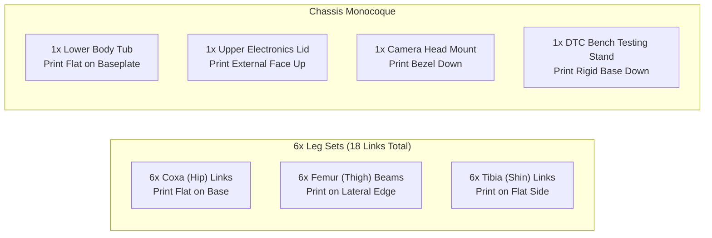
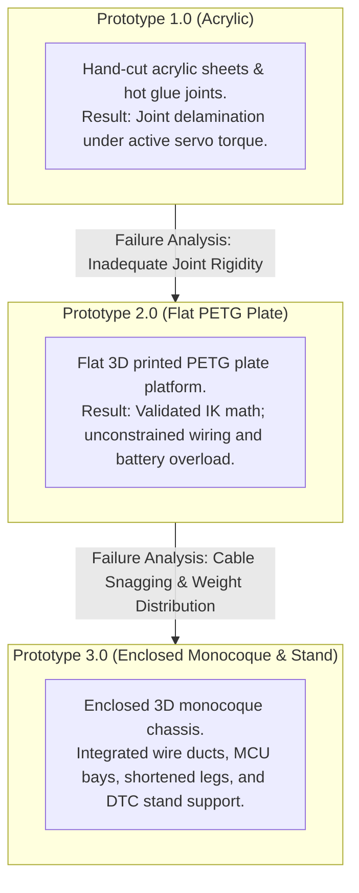

Parametric mechanical assets, 3D printing configurations, and structural assembly guidelines for the 18-DoF Hexapod V2 platform.

## 1. Mechanical fabrication workflow

---

## 2. Parametric 3D CAD assets

| Assembly / part identifier | Description | Status | Interactive CAD link |
| :--- | :--- | :---: | :--- |
| **Enclosed body chassis 2.0 / 3.0** | Integrated electronics bay, wire ducts, and MCU mounts | **Current Release** | [Open body 2.0 in Onshape](https://cad.onshape.com/documents/97670e8943e0cc50e830c42a/w/00e0069e98a6590d172338eb/e/8904dbdba274489211ded1bf?renderMode=0&uiState=6a8cd46a6dfb0f4caeea9e32) |
| **Flat plate chassis 1.0** | Preliminary flat evaluation platform (open wiring) | Prototype (Deprecated) | [Open body 1.0 in Onshape](https://cad.onshape.com/documents/2eb7ad3166d9957057efdbed/w/e8c5560e4175eba75eb554f7/e/949102c48f152406690b75f3?renderMode=0&uiState=6a8cd3263182be2f972a37d2) |
| **3-DoF symmetrical leg assembly** | Symmetrical Coxa, Femur, and Tibia joint linkages | **Current Release** | [Open leg CAD in Onshape](https://cad.onshape.com/documents/ad85265f97458b2bb5a36b9a/w/754aa4f35e9737488e2b5583/e/29b64b050765026b374ec06f?renderMode=0&uiState=6a8cd34b7774753c86709f86) |

---

## 3. PETG slicer profile specifications

| Parameter name | Target setting | Mechanical rationale |
| :--- | :--- | :--- |
| **Filament material** | PETG (Polyethylene Terephthalate Glycol) | High impact strength, flexural endurance, and thermal resilience |
| **Filament diameter** | 1.75 mm (±0.02 mm) | Standard extrusion feedstock |
| **Nozzle diameter** | 0.40 mm brass / hardened steel | Balances fine horn pocket features with rapid perimeter extrusion |
| **Primary layer height** | 0.20 mm | Maximizes interlayer adhesion and shear bonding strength |
| **Initial layer height** | 0.24 mm | Ensures strong base adhesion on textured PEI spring steel bed |
| **Perimeter wall shells** | 4 loops (1.60 mm total thickness) | Resists torsional shear from active 2.2 kg·cm servo output splines |
| **Top / bottom solid layers**| 5 top layers / 4 bottom layers | Prevents structural crush under M2/M3 fastener compression |
| **Internal infill density** | 35% infill | Provides high strength-to-weight ratio for dynamic limb acceleration |
| **Infill pattern** | Gyroid | Isotropic multi-axial mechanical strength without directional weakness |
| **Extruder temperature** | 240°C | Ensures complete polymer melt and interlayer weld strength |
| **Heated bed temperature** | 75°C | Exceeds glass transition point ($T_g$), eliminating corner warping |
| **Cooling fan speed** | 40% (0% for layers 1 to 3) | Preserves ductility and prevents premature embrittlement |
| **Support structure** | Organic / tree supports | Clean removal on servo pocket overhangs and mounting tabs |

---

## 4. Component print orientation and support matrix

| Part identifier | Print qty | Optimal bed orientation | Support requirements | Critical assembly notes |
| :--- | :---: | :--- | :--- | :--- |
| **Coxa (hip link)** | 6 | Flat on servo pocket face | None required | Ensure friction-fit pilot hole alignment for servo horn spline |
| **Femur (thigh beam)** | 6 | Lateral side face flat on bed | Tree supports under horn pocket | 4 perimeter shells mandatory to withstand leg-lifting torque |
| **Tibia (shin / foot)** | 6 | Flat lateral face on bed | Minimal tree supports on pivot | Install TPU or rubber tip at foot contact point for traction |
| **Chassis lower tub** | 1 | Flat on structural baseplate | None required | Features wire pass-through ducts and PCA9685 standoffs |
| **Chassis upper lid** | 1 | Exterior face upward | None required | Houses ESP32-CAM head pivot and snap-fit retention clips |
| **Camera cranial mount**| 1 | Front optical bezel downward | Minimal supports on bracket | Friction clamp securing ESP32-CAM module and flashlight LED |
| **DTC testing stand** | 1 | Flat on rigid baseplate | None required | Elevates chassis to isolate 280g battery weight during validation |

---

## 5. Chassis structural evolution

### Prototype comparison matrix

| Feature / metric | Prototype 1.0 (acrylic) | Prototype 2.0 (flat PETG plate) | Prototype 3.0 (enclosed monocoque) |
| :--- | :--- | :--- | :--- |
| **Chassis material** | 3mm acrylic sheets + adhesive | Flat 3mm 3D printed PETG plate | Contoured 3D PETG monocoque shell |
| **Joint integrity** | Brittle; fractured under load | Ductile; withstands nominal loads | Maximum rigidity with 4 perimeter walls |
| **Electronics protection**| None (exposed wiring) | Open air (wires prone to snags) | Fully enclosed internal electronics bay |
| **Cable management** | Unconstrained loose leads | Cable-tied to flat plate surface | Internal recessed wire routing channels |
| **Mounting standoffs** | Glued plastic posts | Drilled screw holes | Integrated threaded M3 mounting bosses |
| **Leg moment arm** | Unoptimized long levers | Long lever arms (excess torque) | Shortened lever arms reducing servo strain |
| **Presentation baseline** | Static acrylic mockup | Unsupported bench sag | Custom rigid PETG DTC testing stand |