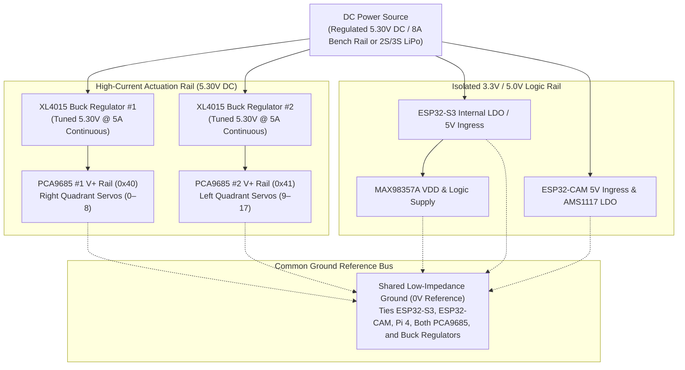
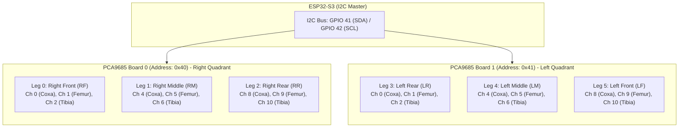

The electrical subsystem provides isolated, low-noise power delivery across 18 high-torque servo actuators, two ESP32 microcontrollers, and an I2S digital audio amplifier.

## Power Distribution Architecture

## Critical Electrical Isolation Rules

1. **Dedicated Actuation Power:** The 18 micro servos draw up to $4.5\text{A}$ to $6.0\text{A}$ cumulative stall current during rapid transitions. Servos must **never** be powered from the ESP32-S3 development board $5\text{V}$ or $3.3\text{V}$ output pins.
2. **Unified Common Ground:** A shared, continuous ground plane connects the power supply, buck converters, ESP32-S3, ESP32-CAM, Raspberry Pi 4B, and both PCA9685 driver boards. Floating ground loops will corrupt high-speed I2C and UART communications.
3. **Voltage Rail Tuning:** Servo buck regulators are calibrated to **$5.30\text{V DC}$**. This provides optimal actuation torque ($2.2\text{ kg}\cdot\text{cm}$) without exceeding the $6.0\text{V}$ maximum operating threshold of the micro servos.

---

## Microcontroller Pinout Specifications

### ESP32-S3 Motion & Audio Controller Pinout (`s3-main`)

| Peripheral Subsystem | Physical Signal | ESP32-S3 GPIO | Operating Voltage | Electrical Constraints / Interface Protocol |
| :--- | :--- | :--- | :---: | :--- |
| **I2C Bus (PCA9685 Drivers)** | `SDA` | **GPIO 41** | 3.3V Logic | 400 kHz Fast-Mode, External 4.7kΩ pull-up resistor |
| | `SCL` | **GPIO 42** | 3.3V Logic | 400 kHz Fast-Mode, External 4.7kΩ pull-up resistor |
| | `OE` (Output Enable) | **GPIO 13** | 3.3V Logic | Active-LOW; Asserted HIGH on boot for Limp state |
| **I2S Audio (MAX98357A)** | `BCLK` (Bit Clock) | **GPIO 40** | 3.3V Logic | 705.6 kHz ($22050\text{ Hz} \times 16\text{ bits} \times 2\text{ channels}$) |
| | `LRC` / `WS` (Word Select) | **GPIO 39** | 3.3V Logic | 22,050 Hz Left/Right channel framing clock |
| | `DIN` (Serial Data Out) | **GPIO 38** | 3.3V Logic | MSB-First 16-bit Mono PCM audio data stream |
| **UART Hardware Telemetry** | `TXD0` | **GPIO 43** | 3.3V TTL | Serial debug output console @ 115,200 Baud |
| | `RXD0` | **GPIO 44** | 3.3V TTL | Serial debug input console @ 115,200 Baud |
| **Inter-Board Serial Link** | `TXD1` / `RXD1` | **GPIO 4 / GPIO 5**| 3.3V TTL | Direct host bridge UART link (Optional fallback) |

---

### ESP32-CAM Vision & Illumination Pinout (`cam-main`)

| Peripheral Subsystem | Camera Signal | ESP32-CAM GPIO | Notes / Internal PCB Wiring |
| :--- | :--- | :--- | :--- |
| **High-Power Flashlight LED** | `LAMP_PWM` | **GPIO 4** | White LED; LEDC Channel 1, 5 kHz PWM dimming |
| **Camera Power & Reset** | `CAM_PIN_PWDN` | **GPIO 32** | Power-down control line |
| | `CAM_PIN_RESET` | **NC (-1)** | Hardware reset pulled permanently HIGH internally |
| | `CAM_PIN_XCLK` | **GPIO 0** | Master Clock input (20 MHz via LEDC Timer 0) |
| **SCCB / I2C Bus** | `CAM_PIN_SIOD` | **GPIO 26** | Serial Camera Control Bus (Data) |
| | `CAM_PIN_SIOC` | **GPIO 27** | Serial Camera Control Bus (Clock) |
| **DVP Parallel Pixel Bus** | `Y9` .. `Y2` | **35, 34, 39, 36, 21, 19, 18, 5** | 8-bit parallel digital video pixel interface |
| **DVP Frame Synchronization**| `VSYNC` | **GPIO 25** | Vertical frame synchronization |
| | `HREF` | **GPIO 23** | Horizontal line reference |
| | `PCLK` | **GPIO 22** | Pixel clock input |

---

## Dual PCA9685 Channel Allocation & Phase Staggering

| Leg Index | Anatomical Position | Joint Segment | Global Ch | PCA Board | I2C Addr | Local Ch | Inverted Logic | Stagger Offset ($\text{Ticks}_{\text{ON}}$) |
| :---: | :---: | :---: | :---: | :---: | :---: | :---: | :---: | :---: |
| **Leg 0** | **Right Front (RF)** | Coxa (Hip Pan) | `0` | PCA 0 | `0x40` | Ch 0 | False | $0\text{ ticks}$ |
| | | Femur (Thigh Lift) | `1` | PCA 0 | `0x40` | Ch 1 | **True** | $150\text{ ticks}$ |
| | | Tibia (Knee Reach) | `2` | PCA 0 | `0x40` | Ch 2 | False | $300\text{ ticks}$ |
| **Leg 1** | **Right Middle (RM)**| Coxa (Hip Pan) | `4` | PCA 0 | `0x40` | Ch 4 | False | $600\text{ ticks}$ |
| | | Femur (Thigh Lift) | `5` | PCA 0 | `0x40` | Ch 5 | **True** | $750\text{ ticks}$ |
| | | Tibia (Knee Reach) | `6` | PCA 0 | `0x40` | Ch 6 | False | $900\text{ ticks}$ |
| **Leg 2** | **Right Rear (RR)** | Coxa (Hip Pan) | `8` | PCA 0 | `0x40` | Ch 8 | False | $1200\text{ ticks}$ |
| | | Femur (Thigh Lift) | `9` | PCA 0 | `0x40` | Ch 9 | **True** | $1350\text{ ticks}$ |
| | | Tibia (Knee Reach) | `10` | PCA 0 | `0x40` | Ch 10 | False | $1500\text{ ticks}$ |
| **Leg 3** | **Left Rear (LR)** | Coxa (Hip Pan) | `16` | PCA 1 | `0x41` | Ch 0 | False | $0\text{ ticks}$ |
| | | Femur (Thigh Lift) | `17` | PCA 1 | `0x41` | Ch 1 | **True** | $150\text{ ticks}$ |
| | | Tibia (Knee Reach) | `18` | PCA 1 | `0x41` | Ch 2 | False | $300\text{ ticks}$ |
| **Leg 4** | **Left Middle (LM)** | Coxa (Hip Pan) | `20` | PCA 1 | `0x41` | Ch 4 | False | $600\text{ ticks}$ |
| | | Femur (Thigh Lift) | `21` | PCA 1 | `0x41` | Ch 5 | **True** | $750\text{ ticks}$ |
| | | Tibia (Knee Reach) | `22` | PCA 1 | `0x41` | Ch 6 | False | $900\text{ ticks}$ |
| **Leg 5** | **Left Front (LF)** | Coxa (Hip Pan) | `24` | PCA 1 | `0x41` | Ch 8 | False | $1200\text{ ticks}$ |
| | | Femur (Thigh Lift) | `25` | PCA 1 | `0x41` | Ch 9 | **True** | $1350\text{ ticks}$ |
| | | Tibia (Knee Reach) | `26` | PCA 1 | `0x41` | Ch 10 | False | $1500\text{ ticks}$ |

---

## Supply Current Ripple Mitigation via Phase-Staggering

When 18 servos are driven synchronously with standard in-phase PWM, simultaneous rising edges cause transient current spikes exceeding $4.5\text{A}$ ($di/dt$), causing logic brownouts and microcontroller reset loops.

To resolve this, the firmware offsets the `ON` tick of each channel:

```mermaid
gantt
    title PWM Phase-Staggered Pulse Timing (20ms Period / 4096 Ticks)
    dateFormat X
    axisFormat %s
    section PCA Board 0
    Ch 0 (RF Coxa)   :active, 0, 400
    Ch 1 (RF Femur)  :active, 150, 550
    Ch 2 (RF Tibia)  :active, 300, 700
    Ch 4 (RM Coxa)   :active, 600, 1000
    Ch 5 (RM Femur)  :active, 750, 1150
    Ch 6 (RM Tibia)  :active, 900, 1300
    Ch 8 (RR Coxa)   :active, 1200, 1600
    Ch 9 (RR Femur)  :active, 1350, 1750
    Ch 10 (RR Tibia) :active, 1500, 1900
    section Margin
    Safe Boundary Margin (Ticks 2740 to 4095) :done, 2740, 4095
```

### Mathematical Staggering Proof

$$\text{ON\_Tick}(ch) = ch \times 150$$
$$\text{OFF\_Tick}(ch) = \text{ON\_Tick}(ch) + \text{Width\_Ticks}$$

Where the 50 Hz PWM counter runs from $0$ to $4095$ ($20\text{ ms}$ period). With a maximum possible pulse width of $2393\,\mu\text{s}$ ($\approx 490\text{ ticks}$), the maximum counter value on channel 15 reaches:

$$\text{Max\_Tick} = (15 \times 150) + 490 = 2250 + 490 = 2740 < 4095$$

Because $\text{Max\_Tick} = 2740 < 4095$, pulse widths never wrap around the 12-bit register boundary, distributing inductive surge current evenly across the entire 20 ms duty cycle window.