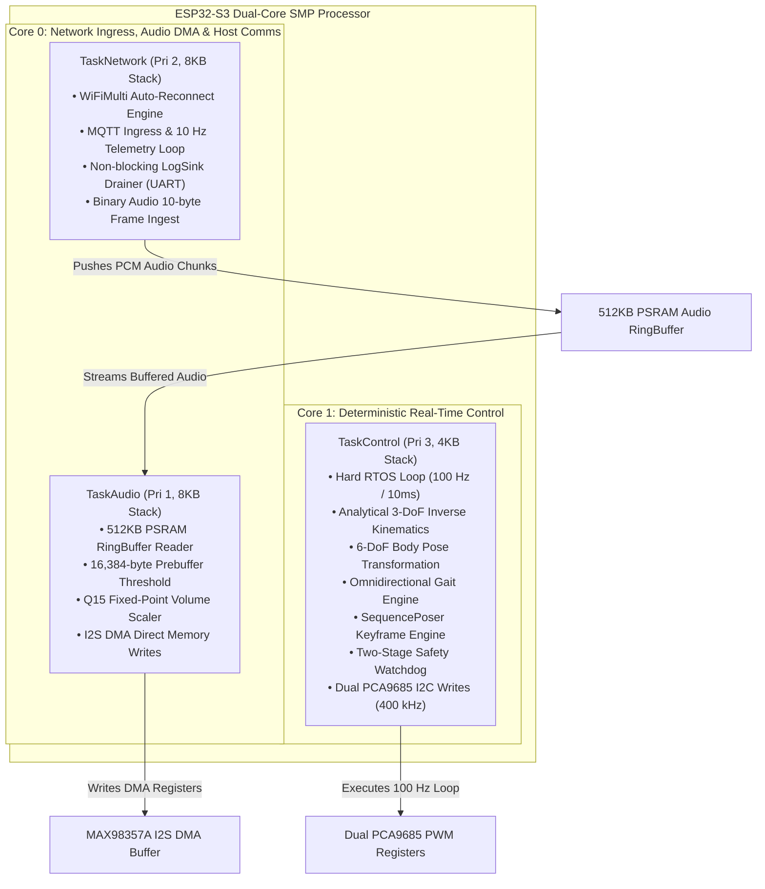
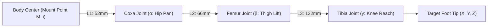
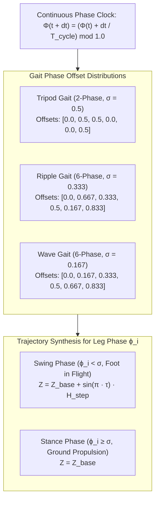
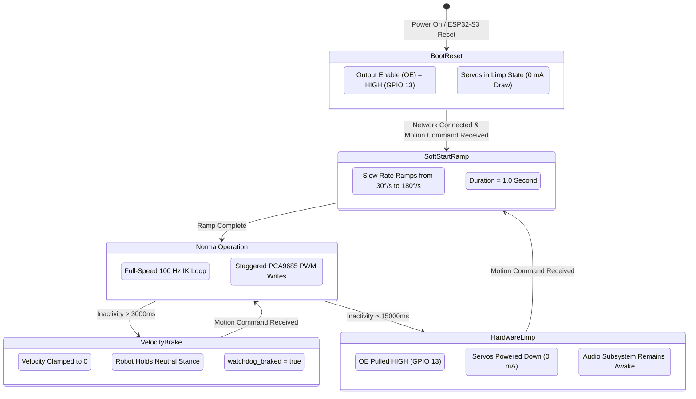

## 1. FreeRTOS dual-core task partitioning



### Core isolation and mutex guarantees
* **Non-blocking control loop:** `TaskControl` on Core 1 executes deterministically every $10.0\text{ ms}$ without preemption from Wi-Fi interrupts. Non-blocking logging pushes string pointers to a bounded FreeRTOS queue (`xQueueSend(..., 0)`). If the queue fills, logs drop silently without delaying the motion loop.
* **I2C bus mutex:** All register writes to the dual PCA9685 controllers are protected by `m_i2cMutex` with a $25\text{ ms}$ hardware timeout to prevent deadlocks from electrical noise.

---

## 2. Analytical 3-DoF inverse kinematics

Each leg operates as an open kinematic chain with three revolute joints: Coxa ($\alpha$, hip pan), Femur ($\beta$, thigh lift), and Tibia ($\gamma$, knee reach).



### Mathematical kinematic derivation

Given a target Cartesian coordinate $(x, y, z)$ in the local frame of hip mounting point $M_i$:

1. **Coxa Angle ($\alpha$):**

$$
\alpha = \operatorname{atan2}(y, x) \cdot \left(\frac{180^\circ}{\pi}\right)
$$

2. **Planar projection and reach vector ($D$):**

$$
\begin{aligned}
d_{\text{planar}} &= \sqrt{x^2 + y^2} - L_1 \\
D &= \sqrt{d_{\text{planar}}^2 + z^2}
\end{aligned}
$$

3. **Reachability boundary clamping:**

$$
D_{\text{clamped}} = \max\Big(\min\big(D, (L_2 + L_3) - 0.1\big), |L_2 - L_3| + 0.1\Big)
$$

4. **Femur angle ($\beta$):**

$$
\begin{aligned}
\alpha_1 &= \operatorname{atan2}(-z, d_{\text{planar}}) \\
\alpha_2 &= \arccos\left(\frac{L_2^2 + D_{\text{clamped}}^2 - L_3^2}{2 \cdot L_2 \cdot D_{\text{clamped}}}\right) \\
\beta &= (\alpha_1 - \alpha_2) \cdot \left(\frac{180^\circ}{\pi}\right)
\end{aligned}
$$

5. **Tibia angle ($\gamma$):**

$$
\begin{aligned}
\beta_{\text{joint}} &= \arccos\left(\frac{L_2^2 + L_3^2 - D_{\text{clamped}}^2}{2 \cdot L_2 \cdot L_3}\right) \\
\gamma &= \left((\pi - \beta_{\text{joint}}) \cdot \left(\frac{180^\circ}{\pi}\right)\right) - 90^\circ
\end{aligned}
$$

---

## 3. 6-DoF rigid body pose transformation

To apply rigid body translations $(\Delta x, \Delta y, \Delta z)$ and Tait-Bryan Euler rotations $(\text{Roll } \phi, \text{Pitch } \theta, \text{Yaw } \psi)$ relative to ground contact points, coordinates transform through forward and inverse mounting orientations.

For leg $i \in \{0 \dots 5\}$ with physical mounting offset $\mathbf{M}_i = [M_{x,i}, M_{y,i}, M_{z,i}]^T$ and mounting angle $\theta_{m,i}$:

1. **Foot position in body coordinate frame:**

$$
\mathbf{P}_{\text{body}, i} = \mathbf{M}_i + \mathbf{R}_z(\theta_{m,i}) \cdot \mathbf{P}_{\text{local}, i}
$$

2. **Inverse rigid body transformation:**

$$
\mathbf{P}_{\text{transformed}, i} = \mathbf{R}_z(-\psi) \mathbf{R}_y(-\theta) \mathbf{R}_x(-\phi) \cdot (\mathbf{P}_{\text{body}, i} - \mathbf{T}_{\text{body}})
$$

Where $\mathbf{T}_{\text{body}} = [\Delta x, \Delta y, \Delta z]^T$.

3. **Local leg frame projection for inverse kinematics:**

$$
\mathbf{P}_{\text{leg\_ik}, i} = \mathbf{R}_z(-\theta_{m,i}) \cdot (\mathbf{P}_{\text{transformed}, i} - \mathbf{M}_i)
$$

Where the principal rotation matrices are defined as:

$$
\begin{aligned}
\mathbf{R}_x(\phi) &= \begin{bmatrix} 1 & 0 & 0 \\ 0 & \cos\phi & -\sin\phi \\ 0 & \sin\phi & \cos\phi \end{bmatrix} \\
\mathbf{R}_y(\theta) &= \begin{bmatrix} \cos\theta & 0 & \sin\theta \\ 0 & 1 & 0 \\ -\sin\theta & 0 & \cos\theta \end{bmatrix} \\
\mathbf{R}_z(\psi) &= \begin{bmatrix} \cos\psi & -\sin\psi & 0 \\ \sin\psi & \cos\psi & 0 \\ 0 & 0 & 1 \end{bmatrix}
\end{aligned}
$$

---

## 4. Omnidirectional gait generator engine

The `GaitGenerator` modulates a normalized phase accumulator $\Phi \in [0.0, 1.0)$ driven by cycle time $T_{\text{cycle}}$:

$$
\Phi(t + \Delta t) = \left(\Phi(t) + \frac{\Delta t}{T_{\text{cycle}}}\right) \bmod 1.0
$$



### Foot trajectory formulations

For leg phase $\phi_i = (\Phi + \text{Offset}_i) \bmod 1.0$:

* **Swing phase ($\phi_i < \sigma$, foot in flight):**

$$
\begin{aligned}
\tau &= \frac{\phi_i}{\sigma} \\
X_{\text{local}}(\tau) &= X_{\text{base}} - L_x + 2 L_x \tau \\
Y_{\text{local}}(\tau) &= Y_{\text{base}} - L_y + 2 L_y \tau \\
Z_{\text{local}}(\tau) &= Z_{\text{base}} + \sin(\pi \tau) \cdot H_{\text{step}}
\end{aligned}
$$

* **Stance phase ($\phi_i \ge \sigma$, ground propulsion):**

$$
\begin{aligned}
\tau &= \frac{\phi_i - \sigma}{1.0 - \sigma} \\
X_{\text{local}}(\tau) &= X_{\text{base}} + L_x - 2 L_x \tau \\
Y_{\text{local}}(\tau) &= Y_{\text{base}} + L_y - 2 L_y \tau \\
Z_{\text{local}}(\tau) &= Z_{\text{base}}
\end{aligned}
$$

Where ground stride vectors incorporate turning angular rate $\omega$:

$$
\begin{aligned}
L_x &= \frac{1}{2} \left(V_x (1 - \sigma) T_{\text{cycle}} - Y_{\text{world}} \cdot \omega_{\text{rad}}\right) \\
L_y &= \frac{1}{2} \left(V_y (1 - \sigma) T_{\text{cycle}} + X_{\text{world}} \cdot \omega_{\text{rad}}\right)
\end{aligned}
$$

---

## 5. Trajectory interpolation and easing functions

The `SequencePoser` dynamically transitions between poses using analytical easing functions:

| Easing identifier | Mathematical formula $s(\tau), \quad \tau \in [0.0, 1.0]$ | Dynamic motion characteristics |
| :--- | :--- | :--- |
| `LINEAR` | $s(\tau) = \tau$ | Constant velocity; discontinuous acceleration. |
| `EASE_IN_OUT_QUAD` | $s(\tau) = 2\tau^2 \ (\tau < 0.5) \text{ or } 1 - \frac{(-2\tau + 2)^2}{2} \ (\tau \ge 0.5)$ | Quadratic acceleration and deceleration. |
| `EASE_IN_OUT_CUBIC` | $s(\tau) = 4\tau^3 \ (\tau < 0.5) \text{ or } 1 - \frac{(-2\tau + 2)^3}{2} \ (\tau \ge 0.5)$ | **Standard:** Smooth S-curve transition profile. |
| `EASE_IN_OUT_SINE` | $s(\tau) = -\frac{1}{2} (\cos(\pi\tau) - 1)$ | Harmonic sinusoidal profile for periodic gestures. |
| `MINIMUM_JERK` | $s(\tau) = 10\tau^3 - 15\tau^4 + 6\tau^5$ | **Quintic polynomial:** Zero boundary jerk ($\dot{s}=\ddot{s}=0$), preventing chassis resonance. |

---

## 6. Multi-stage safety watchdog state machine



---

## 7. Toolchain compilation and firmware flashing

```bash
# Compile and flash ESP32-S3 Motion & Audio Controller
cd firmware/s3-main
pio run -e esp32s3 --target upload
pio device monitor -b 115200

# Compile and flash ESP32-CAM Vision & Sensor Node
cd firmware/cam-main
pio run -e esp32cam --target upload
pio device monitor -b 115200
```