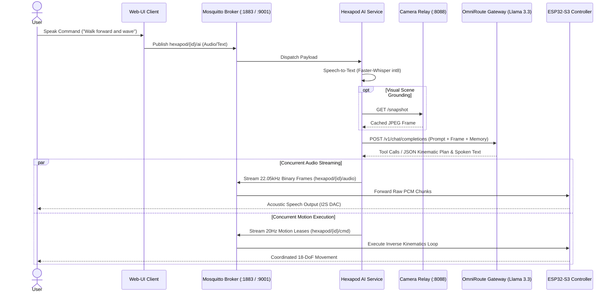
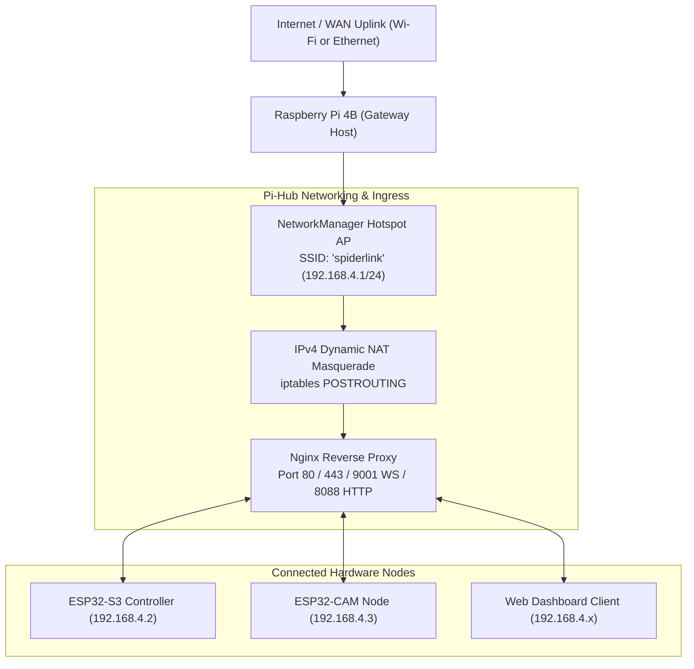
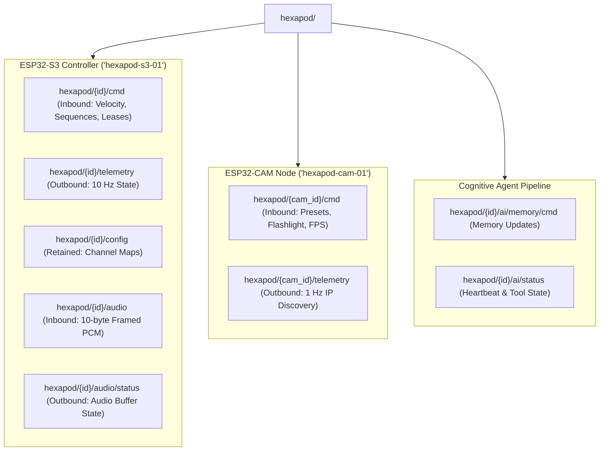
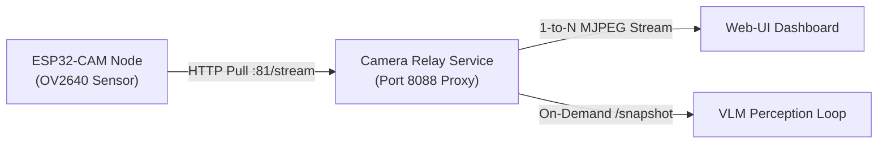

The **Pi-Hub** executes on a Raspberry Pi 4B (or Linux host), coordinating local speech recognition, cloud vision-language models, dynamic camera relays, and low-latency binary audio streaming.

## 1. Cognitive pipeline and multimodal agent workflow



---

## 2. Network topology and ingress routing



---

## 3. MQTT communication topic taxonomy



---

## 4. Binary audio stream protocol specification

Low-latency speech audio streams from the Raspberry Pi `ai-service` to the ESP32-S3 `TaskAudio` using framed raw PCM packets to eliminate JSON Base64 decode overhead:

| Byte offset | Field identifier | Type | Endianness | Validation criteria |
| :---: | :--- | :--- | :--- | :--- |
| `0x00` | `MAGIC_BYTE` | `uint8_t` | — | Must equal `0xAA` to distinguish from JSON payloads. |
| `0x01` | `ACTION_FLAG` | `uint8_t` | — | `0x00` = Stream Audio Chunk; `0x01` = Abort Active Stream. |
| `0x02..0x05` | `FLOW_ID` | `uint32_t` | Little | Unique pseudo-random stream identifier generated per utterance. |
| `0x06..0x07` | `SEQUENCE_IDX` | `uint16_t` | Little | 0-indexed packet sequence counter ($0 \dots \text{Total}-1$). |
| `0x08..0x09` | `TOTAL_CHUNKS` | `uint16_t` | Little | Total packets in utterance ($0$ denotes unbounded media stream). |
| `0x0A..N` | `PCM_PAYLOAD` | `int16_t[]` | Little | 22,050 Hz Mono 16-bit PCM samples (max 4,096 bytes per chunk). |

### PSRAM ring buffer and jitter management

1. Incoming frames on Core 0 extract the raw PCM slice and push to a 512KB PSRAM `RingBuffer`.
2. `TaskAudio` enforces a **16,384-byte prebuffer threshold** ($\approx 370\text{ ms}$) before triggering the I2S DMA controller, preventing buffer underruns during Wi-Fi latency spikes.
3. Software volume is scaled sample-by-sample using Q15 fixed-point multiplication:

$$
\text{Sample}_{\text{out}} = \frac{\text{Sample}_{\text{in}} \times \text{volQ15}}{32768}, \quad \text{where } \text{volQ15} \in [0, 32767]
$$

---

## 5. Canonical task decomposition JSON contract

```json
{
  "task_title": "Inspect and Wave",
  "thought": "User requested visual inspection followed by greeting. Moving forward, turning flashlight on, capturing frame, and waving.",
  "speech": "Advancing to inspect the target area.",
  "order": "tts_first",
  "camera": {
    "preset": "inspection",
    "flash": 40
  },
  "audio": {
    "volume": 0.5,
    "alarm": "curious"
  },
  "timeline": [
    {
      "type": "gait",
      "id": "walk_forward",
      "duration_ms": 3000,
      "params": { "vx": 45.0, "vy": 0.0, "omega": 0.0, "gait": "tripod", "step_height": 40.0 }
    },
    {
      "type": "gesture",
      "id": "wave",
      "duration_ms": 2200
    }
  ]
}
```

---

## 6. Cognitive tool registry and function calling

| Tool identifier | Parameters | Functional role |
| :--- | :--- | :--- |
| `inspect_scene` | `query: str` | Captures live frame from `/snapshot` to ground multimodal reasoning. |
| `get_weather` | `location: str` | Retrieves live temperature, humidity, and forecast via Open-Meteo API. |
| `web_search` | `query: str` | Performs instant web summaries via DuckDuckGo and Wikipedia APIs. |
| `set_timer` | `duration_seconds: int, label: str` | Sets asynchronous countdown timer with audio alarms upon completion. |
| `cancel_timer` | `label: str` | Cancels an active countdown timer. |
| `play_music` | `query: str` | Streams YouTube/local audio via `yt-dlp` and `ffmpeg` with auto-ducking. |

---

## 7. Dynamic video stream relay and camera control



### Camera tuning parameter matrix

| Parameter name | Value range / type | Sensor hardware effect |
| :--- | :--- | :--- |
| `preset` | `night_vision`, `inspection`, `stealth`, `low_power`, `default` | Configures flashlight, exposure, gain ceiling, and resolution atomically. |
| `flash` | `0` to `100` (%) | Modulates LEDC Channel 1 duty cycle driving the white LED via GPIO 4. |
| `fps` | `1` to `30` (Hz) | Adjusts capture loop task delay (`framePeriodUs`). |
| `framesize` | `96X96`, `QVGA`, `VGA`, `HD`, `FHD` | Reconfigures sensor active pixel array windowing. |
| `quality` | `0` to `63` | JPEG quantization matrix scaling ($8 = \text{High Detail}$, $12 = \text{Default}$). |
| `crop` | `[startX, startY, width, height]` | Hardware sensor windowing for zero-latency digital zoom. |