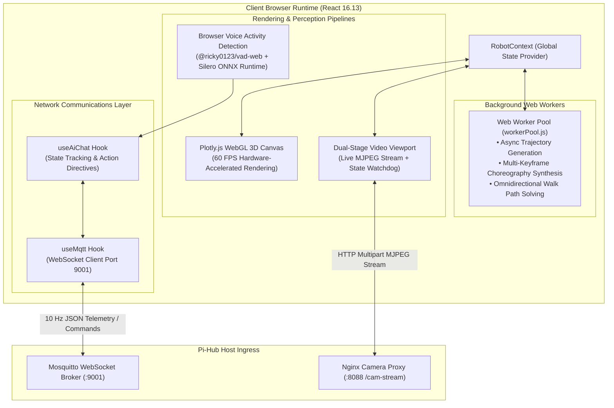
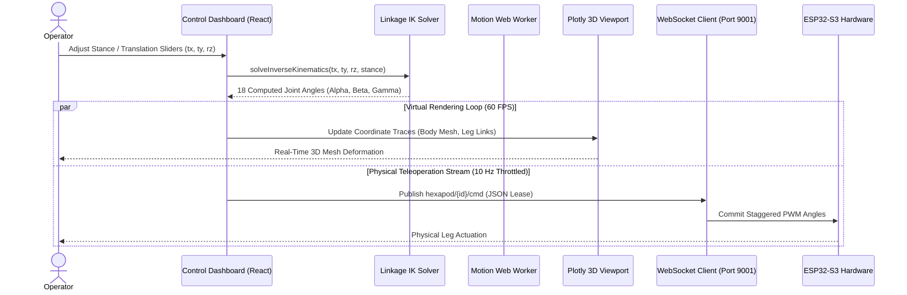
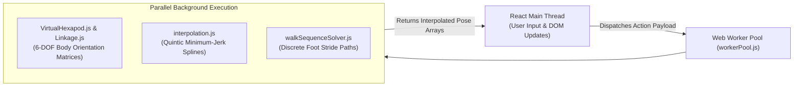
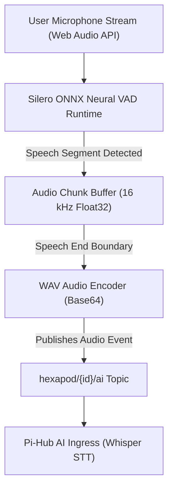

The **Web UI** serves as the primary human-machine interface (HMI) and virtual kinematics simulator for the Hexapod V2 platform. Built with React and Plotly.js, it synchronizes physical hardware telemetry with an interactive 3D digital twin over WebSockets.

## Frontend Architecture Topology



---

## Real-Time Teleoperation & 3D State Synchronization

When an operator adjusts kinematic sliders or when the physical robot traverses terrain, state synchronization executes with sub-50ms latency:



---

## Background Motion Offloading & Worker Pool

To prevent the browser main UI thread from dropping frames during intensive trigonometric calculations, heavy choreographies are delegated to dedicated Web Workers:



1. **Virtual Hexapod Geometry:** Analytically calculates body mounting vertices, center-of-gravity projections, and foot-ground intersection vectors (`VirtualHexapod.js`, `Vector.js`).
2. **Trajectory Splines:** Generates smooth Bezier and quintic minimum-jerk keyframe transitions for complex gestures (e.g., wave, push-ups, dance) (`interpolation.js`).
3. **Walk Path Solver:** Dynamically compiles phase offsets, step heights, and hip splay angles for tripod and ripple gaits (`walkSequenceSolver.js`).

---

## Browser-Based Voice Activity Detection (VAD)

The Web UI functions as a distributed smart speaker without requiring third-party audio recording daemons:



* **Zero-Cloud Audio Preprocessing:** Speech boundary detection executes 100% locally in the browser utilizing `@ricky0123/vad-web` and an optimized WebAssembly/ONNX runtime.
* **Bandwidth Optimization:** Audio transmits over WebSockets only when active speech is validated, eliminating continuous microphone streaming overhead.

---

## Core UI Modules & Capabilities

| Module Name | Source Files | Functional Capabilities |
| :--- | :--- | :--- |
| **Dual-Stage Viewport** | `src/components/viewport/` | Split-screen container hosting WebGL 3D model alongside live ESP32-CAM MJPEG stream. |
| **Inverse Kinematics Tuner** | `src/components/pages/PageIK.js` | Direct manipulation of body translation $(t_x, t_y, t_z)$ and Euler rotation $(\phi, \theta, \psi)$. |
| **Gait Selector & Sequencer** | `src/components/pages/PageGait.js` | Modulates step height, stride velocity $(V_x, V_y)$, turning rate $\omega$, and gait duty cycles. |
| **AI Copilot Terminal** | `src/components/ai/AiChatModal.js` | Visualizes real-time LLM reasoning chains, tokens-per-second metrics, and active skills. |
| **Long-Term Memory Manager** | `src/components/hub/MemoryManager.js` | Interface for inspecting and pruning stored contextual facts in `memory_pool.json`. |

---

## Frontend Setup & Development

```bash
# 1. Enter web UI directory and install dependencies
cd spiderbot-mithi-web
npm install

# 2. Start local development server (React 16.13)
npm start

# 3. Compile optimized production static build
npm run build
```