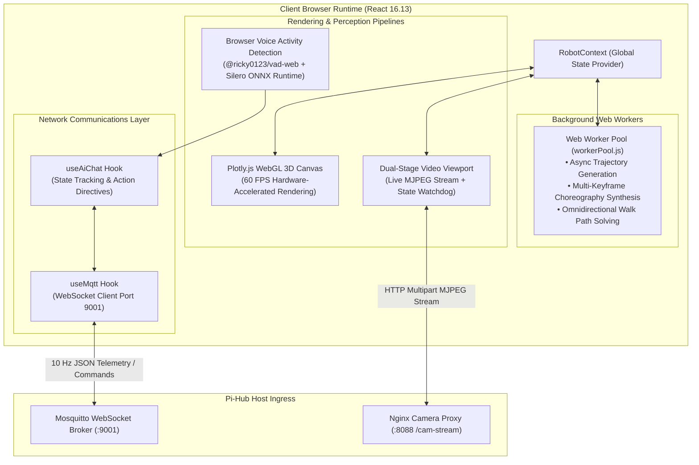
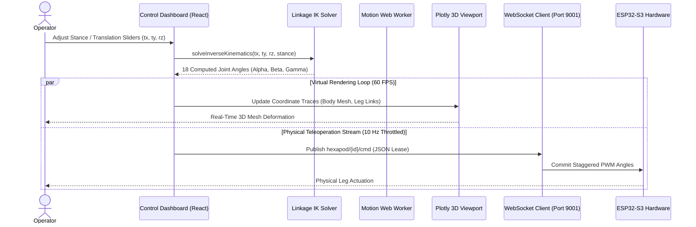
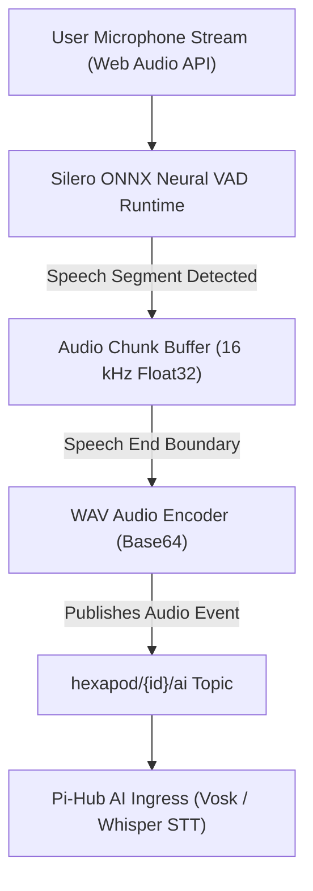

The **Web UI** serves as the primary human-machine interface (HMI) and virtual kinematics simulator for the Hexapod V2 platform. Built with React and Plotly.js, it synchronizes physical hardware telemetry with an interactive 3D digital twin over WebSockets.

## 1. Frontend architecture topology



---

## 2. Teleoperation and 3D state synchronization

When an operator adjusts kinematic sliders or when the physical robot traverses terrain, state synchronization executes with sub-50ms latency:



---

## 3. Background motion offloading and worker pool

To prevent the browser main UI thread from dropping frames during intensive trigonometric calculations, heavy choreographies are delegated to dedicated Web Workers:


1. **Virtual hexapod geometry:** Analytically calculates body mounting vertices, center-of-gravity projections, and foot-ground intersection vectors (`VirtualHexapod.js`, `Vector.js`).
2. **Trajectory splines:** Generates smooth Bezier and quintic minimum-jerk keyframe transitions for complex gestures (`interpolation.js`).
3. **Walk path solver:** Dynamically compiles phase offsets, step heights, and hip splay angles for tripod and ripple gaits (`walkSequenceSolver.js`).

---

## 4. Browser-based voice activity detection

The Web UI functions as a distributed smart speaker without requiring third-party audio recording daemons:



* **Zero-cloud audio preprocessing:** Speech boundary detection executes 100% locally in the browser utilizing `@ricky0123/vad-web` and an optimized WebAssembly/ONNX runtime.
* **Bandwidth optimization:** Audio transmits over WebSockets only when active speech is validated, eliminating continuous microphone streaming overhead.

---

## 5. Core interface modules and capabilities

| Module name | Source files | Functional capabilities |
| :--- | :--- | :--- |
| **Dual-stage viewport** | `src/components/viewport/` | Split-screen container hosting WebGL 3D model alongside live ESP32-CAM MJPEG stream. |
| **Inverse kinematics tuner** | `src/components/pages/PageIK.js` | Direct manipulation of body translation $(t_x, t_y, t_z)$ and Euler rotation $(\phi, \theta, \psi)$. |
| **Gait selector and sequencer** | `src/components/pages/PageGait.js` | Modulates step height, stride velocity $(V_x, V_y)$, turning rate $\omega$, and gait duty cycles. |
| **AI copilot terminal** | `src/components/ai/AiChatModal.js` | Visualizes real-time LLM reasoning chains, tokens-per-second metrics, and active skills. |
| **Long-term memory manager** | `src/components/hub/MemoryManager.js` | Interface for inspecting and mutating stored contextual facts in `memory_pool.json`. |

---

## 6. Local development and build workflow

```bash
# 1. Enter web UI directory and install dependencies
cd spiderbot-mithi-web
npm install

# 2. Build Tailwind CSS stylesheet assets
npm run tailwind:build

# 3. Start local development server (React 16.13)
npm start

# 4. Compile optimized production static build
npm run build
```