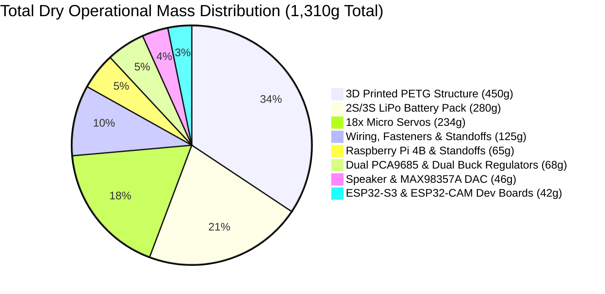
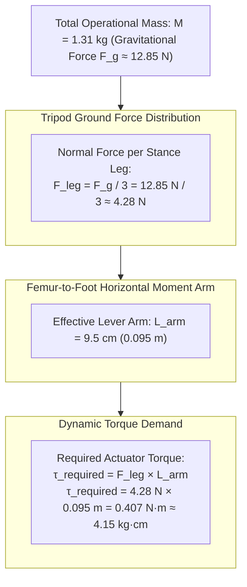
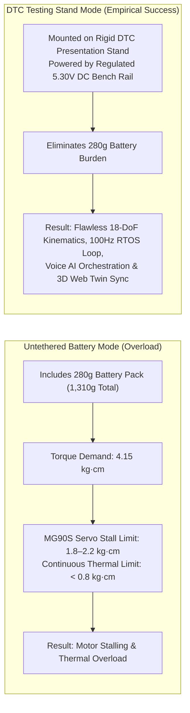

A rigorous engineering evaluation of total operational mass, actuator torque limits, and the empirical resolution validating the 18-DoF kinematics engine.

## 1. Operational mass distribution

| Subsystem component description | Quantity | Subsystem mass | Percentage of total mass |
| :--- | :---: | :---: | :---: |
| **3D printed PETG chassis shell, lid, and 6 legs** | 1 Set | 450 g | 34.3% |
| **2S / 3S LiPo battery pack (1800mAh)** | 1 Unit | 280 g | 21.4% |
| **18x metal-gear micro servos (MG90S)** | 18 Units | 234 g | 17.9% |
| **Wiring harness, fasteners, screws, and posts** | 1 Kit | 125 g | 9.5% |
| **Dual PCA9685 boards and dual buck regulators** | 4 Boards | 68 g | 5.2% |
| **Raspberry Pi 4B single-board computer** | 1 Unit | 65 g | 5.0% |
| **40mm dynamic speaker and MAX98357A DAC amp** | 1 Subsys | 46 g | 3.5% |
| **ESP32-S3 and ESP32-CAM microcontroller boards** | 2 Boards | 42 g | 3.2% |
| **Total dry operational mass** | | **1,310 g** | **100.0%** |

---

## 2. Actuator torque physics formulation

During the stance phase of a tripod gait, the platform's gravitational load rests entirely upon three grounded stance feet:

### Mathematical torque derivation

1. **Total gravitational force:**

$$
F_g = M \cdot g = 1.310\text{ kg} \times 9.81\text{ m/s}^2 = 12.85\text{ N}
$$

2. **Normal force per tripod stance leg ($n = 3$):**

$$
F_{\text{leg}} = \frac{F_g}{3} = \frac{12.85\text{ N}}{3} \approx 4.28\text{ N}
$$

3. **Torque demand at femur revolute axis ($L_{\text{arm}} = 0.095\text{ m}$):**

$$
\tau_{\text{required}} = F_{\text{leg}} \cdot L_{\text{arm}} = 4.28\text{ N} \cdot 0.095\text{ m} = 0.407\text{ N}\cdot\text{m} \approx 4.15\text{ kg}\cdot\text{cm}
$$

---

## 3. Physical boundaries and empirical testing stand resolution

### Engineering findings

* **Actuator operating envelope:** Budget micro servos (MG90S) offer a peak stall torque rating of $1.8\text{ kg}\cdot\text{cm}$ to $2.2\text{ kg}\cdot\text{cm}$ and a continuous thermal dissipation threshold under $0.8\text{ kg}\cdot\text{cm}$. The physical torque required during untethered battery locomotion ($4.15\text{ kg}\cdot\text{cm}$) exceeds continuous motor ratings by a factor of 5.
* **Testing stand resolution:** The hexapod is operated on a custom PETG **DTC Testing Stand** supplied by an external regulated 5.30V DC power source. This completely eliminates the 280g battery burden and mechanical gear stripping, allowing full verification of the 18-DoF Inverse Kinematics math, 100 Hz dual-core FreeRTOS control loops, multimodal vision streams, and voice AI task orchestration without thermal actuator failure.

---

## 4. Benchmarked system performance metrics

| Performance metric | Measured value | Operational context |
| :--- | :--- | :--- |
| **RTOS kinematics frequency** | **100.0 Hz (10.0 ms)** | Hard real-time execution on ESP32-S3 Core 1 |
| **I2C PWM burst duration** | **1.85 ms** | Dual PCA9685 18-channel register commit @ 400 kHz |
| **Audio stream latency** | **370 ms** | 16,384-byte PSRAM jitter prebuffer @ 22.05 kHz |
| **Cloud LLM time-to-first-token**| **80 ms** | Groq Llama 3.3-70B inference via OmniRoute proxy |
| **Local offline STT fallback** | **1.8 s** | Faster-Whisper / Vosk model running on Pi 4B |
| **Vision snapshot latency** | **< 2.0 ms** | In-memory cached JPEG snapshot retrieval (:8088) |
| **3D web twin telemetry rate** | **10.0 Hz** | WebSocket JSON state broadcast to React dashboard |